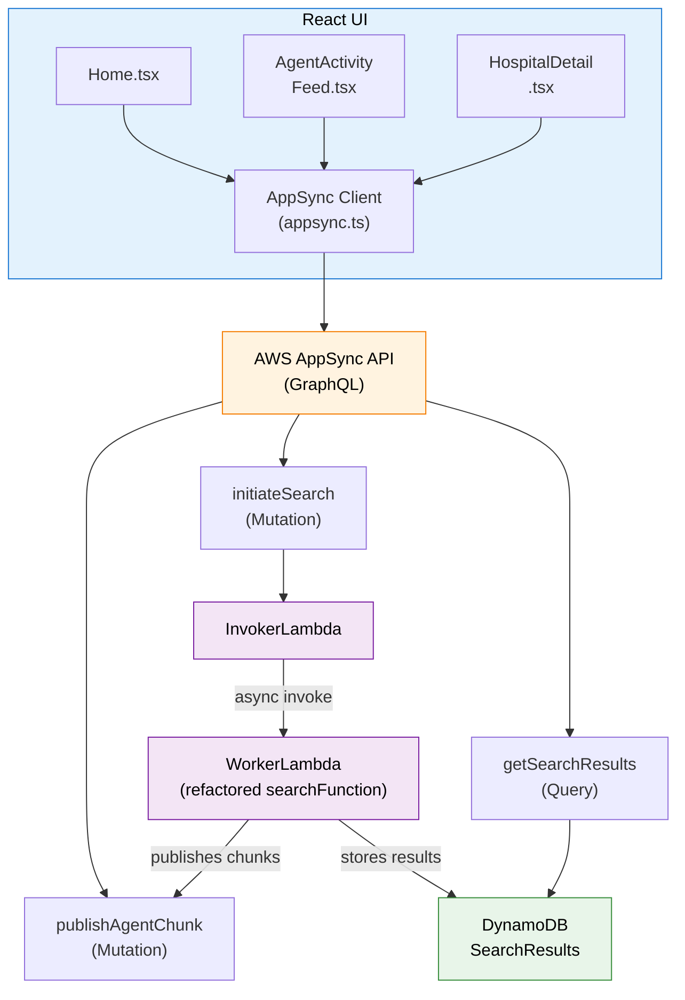
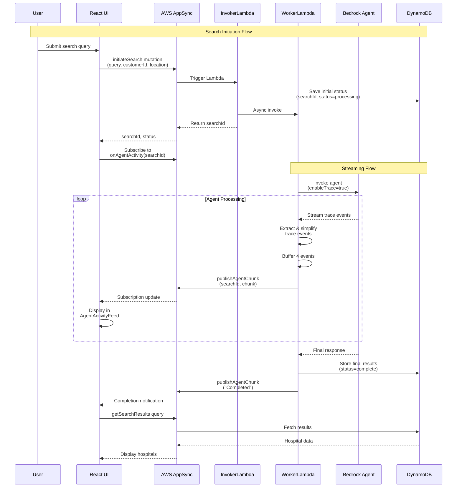

# AppSync Streaming Search - Design Document

## 1. Architecture Overview

### 1.1 High-Level Architecture



### 1.2 Data Flow



## 2. Component Design

### 2.1 AWS AppSync API

#### 2.1.1 GraphQL Schema

**File**: `aws/appsync/schema.graphql`

```graphql
# Input Types
input LocationInput {
  latitude: Float!
  longitude: Float!
}

# Output Types
type SearchInitiated {
  searchId: ID!
  status: String!
}

type AgentChunk {
  searchId: ID!
  chunk: String!
  timestamp: AWSDateTime!
}

type Hospital {
  id: ID!
  name: String!
  location: String!
  rating: Float!
  reviewCount: Int!
  imageUrl: String
  description: String
  specialties: [String!]!
  acceptedInsurance: [String!]!
  avgCostRange: CostRange!
  aiRecommendation: String!
  insuranceCoveragePercent: Int!
  trustScore: Int!
  verificationBadge: String!
  coordinates: Coordinates
  distance: Float
  topDoctorIds: [ID!]!
}

type CostRange {
  min: Int!
  max: Int!
}

type Coordinates {
  latitude: Float!
  longitude: Float!
}

type SearchResultsData {
  aiSummary: String!
  hospitals: [Hospital!]!
}

type SearchResults {
  searchId: ID!
  status: String!
  results: SearchResultsData
  error: String
}

# Mutations
type Mutation {
  initiateSearch(
    query: String!
    customerId: String
    userLocation: LocationInput
  ): SearchInitiated
  
  publishAgentChunk(
    searchId: ID!
    chunk: String!
  ): AgentChunk
}

# Queries
type Query {
  getSearchResults(searchId: ID!): SearchResults
}

# Subscriptions
type Subscription {
  onAgentActivity(searchId: ID!): AgentChunk
    @aws_subscribe(mutations: ["publishAgentChunk"])
}

schema {
  query: Query
  mutation: Mutation
  subscription: Subscription
}
```

#### 2.1.2 Resolvers

**initiateSearch Resolver:**
- Type: Lambda
- Data Source: InvokerLambda
- Request Mapping: Pass through all arguments
- Response Mapping: Return searchId and status

**publishAgentChunk Resolver:**
- Type: Lambda
- Data Source: WorkerLambda (or NONE if called directly)
- Request Mapping: Pass through searchId and chunk
- Response Mapping: Return AgentChunk with timestamp

**getSearchResults Resolver:**
- Type: Lambda
- Data Source: New Lambda or direct DynamoDB
- Request Mapping: Pass searchId
- Response Mapping: Return SearchResults from DynamoDB

### 2.2 InvokerLambda

#### 2.2.1 Function Specification

**Name**: `searchInvokerFunction`
**Runtime**: Python 3.11
**Timeout**: 10 seconds
**Memory**: 256 MB

**Environment Variables:**
- `WORKER_FUNCTION_NAME`: Name of WorkerLambda
- `DYNAMODB_TABLE_NAME`: SearchResults table name
- `DYNAMODB_REGION`: DynamoDB region

**IAM Permissions:**
- `lambda:InvokeFunction` on WorkerLambda
- `dynamodb:PutItem` on SearchResults table

#### 2.2.2 Implementation

**File**: `aws/lambda/searchInvokerFunction/lambda_function.py`

```python
import json
import boto3
import os
import time
import uuid
from datetime import datetime, timezone

lambda_client = boto3.client("lambda")
dynamodb = boto3.resource("dynamodb", region_name=os.environ.get("DYNAMODB_REGION", "eu-north-1"))
search_results_table = dynamodb.Table(os.environ.get("DYNAMODB_TABLE_NAME", "SearchResults"))

WORKER_FUNCTION_NAME = os.environ.get("WORKER_FUNCTION_NAME", "searchWorkerFunction")
SEARCH_RESULT_TTL_HOURS = 5

def lambda_handler(event, context):
    """
    AppSync resolver for initiateSearch mutation.
    Generates searchId, saves to DynamoDB, invokes WorkerLambda async.
    """
    # Extract arguments from AppSync event
    arguments = event.get("arguments", {})
    query = arguments.get("query")
    customer_id = arguments.get("customerId", "anonymous")
    user_location = arguments.get("userLocation")
    
    # Generate searchId
    request_id = context.request_id[:12] if context else uuid.uuid4().hex[:12]
    search_id = f"search_{int(time.time())}_{request_id}"
    
    # Save initial status to DynamoDB
    ttl = int(time.time()) + (SEARCH_RESULT_TTL_HOURS * 3600)
    item = {
        "searchId": search_id,
        "status": "processing",
        "updatedAt": datetime.now(timezone.utc).isoformat(),
        "ttl": ttl
    }
    
    if user_location:
        item["userLocation"] = user_location
    
    search_results_table.put_item(Item=item)
    
    # Invoke WorkerLambda asynchronously
    payload = {
        "searchId": search_id,
        "query": query,
        "customerId": customer_id,
        "userLocation": user_location
    }
    
    lambda_client.invoke(
        FunctionName=WORKER_FUNCTION_NAME,
        InvocationType="Event",  # Async invocation
        Payload=json.dumps(payload)
    )
    
    # Return immediately
    return {
        "searchId": search_id,
        "status": "processing"
    }
```

### 2.3 WorkerLambda

#### 2.3.1 Function Specification

**Name**: `searchWorkerFunction`
**Runtime**: Python 3.11
**Timeout**: 60 seconds
**Memory**: 1024 MB

**Environment Variables:**
- `BEDROCK_AGENT_ID`: Bedrock Agent ID
- `BEDROCK_AGENT_ALIAS_ID`: Bedrock Agent Alias ID
- `BEDROCK_REGION`: Bedrock region
- `API_GATEWAY_BASE_URL`: API Gateway base URL
- `DYNAMODB_TABLE_NAME`: SearchResults table name
- `DYNAMODB_REGION`: DynamoDB region
- `APPSYNC_ENDPOINT`: AppSync GraphQL endpoint
- `APPSYNC_API_KEY`: AppSync API key

**IAM Permissions:**
- `bedrock:InvokeAgent` on Bedrock Agent
- `dynamodb:PutItem` on SearchResults table
- `appsync:GraphQL` on AppSync API

#### 2.3.2 Implementation Structure

**File**: `aws/lambda/searchWorkerFunction/lambda_function.py`

This is a refactored version of the existing `searchFunction`. Key changes:

1. **Add AppSync Publishing**:
```python
import urllib3

http = urllib3.PoolManager(maxsize=10)

APPSYNC_ENDPOINT = os.environ.get("APPSYNC_ENDPOINT")
APPSYNC_API_KEY = os.environ.get("APPSYNC_API_KEY")

def publish_agent_chunk(search_id: str, chunk: str):
    """Publish agent activity chunk to AppSync."""
    mutation = """
    mutation PublishAgentChunk($searchId: ID!, $chunk: String!) {
        publishAgentChunk(searchId: $searchId, chunk: $chunk) {
            searchId
            chunk
            timestamp
        }
    }
    """
    
    body = json.dumps({
        "query": mutation,
        "variables": {
            "searchId": search_id,
            "chunk": chunk
        }
    })
    
    response = http.request(
        "POST",
        APPSYNC_ENDPOINT,
        body=body,
        headers={
            "Content-Type": "application/json",
            "x-api-key": APPSYNC_API_KEY
        }
    )
    
    logger.info(f"Published chunk to AppSync | SearchId={search_id} | Response={response.status}")
```

2. **Add Trace Simplification**:
```python
def simplify_trace(event: dict) -> str:
    """Simplify Bedrock Agent trace event to human-readable text."""
    try:
        if "trace" not in event:
            return "Processing..."
        
        orchestration = event["trace"]["trace"]["orchestrationTrace"]
        
        if "rationale" in orchestration:
            return orchestration["rationale"]["text"]
        
        if "modelInvocationInput" in orchestration:
            return "🤔 Agent thinking..."
        
        if "modelInvocationOutput" in orchestration:
            return "✓ Model responded"
        
        if "observation" in orchestration:
            obs = orchestration["observation"]
            if "actionGroupInvocationOutput" in obs:
                return "🔍 Searching database..."
            if "knowledgeBaseLookupOutput" in obs:
                return "📚 Consulting knowledge base..."
        
        return "Processing..."
    
    except Exception as e:
        logger.warning(f"Failed to simplify trace: {e}")
        return "Processing..."
```

3. **Modify invoke_bedrock_agent to Stream**:
```python
def invoke_bedrock_agent_with_streaming(
    search_id: str,
    query: str,
    customer_id: str,
    max_retries: int = 3
) -> dict:
    """
    Invoke Bedrock Agent with trace streaming to AppSync.
    """
    # Get session ID from environment variable or use customer_id as fallback
    session_id = os.environ.get("BEDROCK_SESSION_ID", customer_id)
    
    for attempt in range(1, max_retries + 1):
        try:
            response = bedrock_agent_runtime.invoke_agent(
                agentId=BEDROCK_AGENT_ID,
                agentAliasId=BEDROCK_AGENT_ALIAS_ID,
                sessionId=session_id,
                inputText=query,
                enableTrace=True  # CRITICAL: Enable trace
            )
            
            full_response = ""
            buffer = []
            chunk_count = 0
            
            # Process streaming events
            for event in response.get("completion", []):
                chunk_count += 1
                
                # Simplify trace and add to buffer
                simplified = simplify_trace(event)
                logger.info(f"Trace {chunk_count}: {simplified}")
                buffer.append(simplified)
                
                # Publish every 4 events
                if len(buffer) >= 4:
                    publish_agent_chunk(search_id, "\n".join(buffer))
                    buffer = []
                    time.sleep(0.2)  # Rate limiting
                
                # Collect response chunks
                if "chunk" in event:
                    chunk = event["chunk"]
                    if "bytes" in chunk:
                        chunk_data = chunk["bytes"].decode("utf-8")
                        full_response += chunk_data
            
            # Publish remaining buffer
            if buffer:
                publish_agent_chunk(search_id, "\n".join(buffer))
            
            # Parse final response
            json_start = full_response.find('{')
            if json_start == -1:
                raise ValueError("No JSON in response")
            
            json_str = full_response[json_start:]
            llm_data = json.loads(json_str)
            
            return llm_data
        
        except Exception as e:
            logger.error(f"Attempt {attempt} failed: {e}")
            if attempt < max_retries:
                time.sleep(1)
                continue
            raise
```

4. **Update Main Handler**:
```python
def lambda_handler(event, context):
    """
    Main handler for WorkerLambda.
    Invoked asynchronously by InvokerLambda.
    """
    try:
        search_id = event.get("searchId")
        query = event.get("query")
        customer_id = event.get("customerId")
        user_location = event.get("userLocation")
        
        logger.info(f"Worker started | SearchId={search_id}")
        
        # Publish initial status
        publish_agent_chunk(search_id, "🚀 Starting search...")
        
        # Invoke Bedrock Agent with streaming
        llm_response = invoke_bedrock_agent_with_streaming(
            search_id, query, customer_id
        )
        
        # Store results in DynamoDB
        save_search_results(
            search_id,
            "complete",
            llm_response=llm_response,
            user_location=user_location
        )
        
        # Publish completion
        publish_agent_chunk(search_id, "✅ Search completed!")
        
        logger.info(f"Worker completed | SearchId={search_id}")
        
        return {
            "statusCode": 200,
            "body": json.dumps({"searchId": search_id})
        }
    
    except Exception as e:
        logger.exception(f"Worker failed | SearchId={search_id}")
        
        # Store error in DynamoDB
        save_search_results(search_id, "error", error=str(e))
        
        # Publish error
        try:
            publish_agent_chunk(search_id, f"❌ Error: {str(e)}")
        except:
            pass
        
        return {
            "statusCode": 500,
            "body": json.dumps({"error": str(e)})
        }
```

### 2.4 Frontend Components

#### 2.4.1 AppSync Client Setup

**File**: `app/src/app/services/appsync.ts`

```typescript
import { ApolloClient, InMemoryCache, HttpLink, split } from '@apollo/client';
import { GraphQLWsLink } from '@apollo/client/link/subscriptions';
import { getMainDefinition } from '@apollo/client/utilities';
import { createClient } from 'graphql-ws';

const APPSYNC_ENDPOINT = import.meta.env.VITE_APPSYNC_ENDPOINT;
const APPSYNC_API_KEY = import.meta.env.VITE_APPSYNC_API_KEY;
const APPSYNC_REALTIME_ENDPOINT = APPSYNC_ENDPOINT.replace('https://', 'wss://').replace('/graphql', '/graphql/realtime');

// HTTP link for queries and mutations
const httpLink = new HttpLink({
  uri: APPSYNC_ENDPOINT,
  headers: {
    'x-api-key': APPSYNC_API_KEY,
  },
});

// WebSocket link for subscriptions
const wsLink = new GraphQLWsLink(
  createClient({
    url: APPSYNC_REALTIME_ENDPOINT,
    connectionParams: {
      headers: {
        'x-api-key': APPSYNC_API_KEY,
        host: new URL(APPSYNC_ENDPOINT).host,
      },
    },
  })
);

// Split based on operation type
const splitLink = split(
  ({ query }) => {
    const definition = getMainDefinition(query);
    return (
      definition.kind === 'OperationDefinition' &&
      definition.operation === 'subscription'
    );
  },
  wsLink,
  httpLink
);

export const appsyncClient = new ApolloClient({
  link: splitLink,
  cache: new InMemoryCache(),
});
```

#### 2.4.2 GraphQL Operations

**File**: `app/src/app/services/graphql/operations.ts`

```typescript
import { gql } from '@apollo/client';

export const INITIATE_SEARCH = gql`
  mutation InitiateSearch(
    $query: String!
    $customerId: String
    $userLocation: LocationInput
  ) {
    initiateSearch(
      query: $query
      customerId: $customerId
      userLocation: $userLocation
    ) {
      searchId
      status
    }
  }
`;

export const ON_AGENT_ACTIVITY = gql`
  subscription OnAgentActivity($searchId: ID!) {
    onAgentActivity(searchId: $searchId) {
      searchId
      chunk
      timestamp
    }
  }
`;

export const GET_SEARCH_RESULTS = gql`
  query GetSearchResults($searchId: ID!) {
    getSearchResults(searchId: $searchId) {
      searchId
      status
      results {
        aiSummary
        hospitals {
          id
          name
          location
          rating
          reviewCount
          imageUrl
          description
          specialties
          acceptedInsurance
          avgCostRange {
            min
            max
          }
          aiRecommendation
          insuranceCoveragePercent
          trustScore
          verificationBadge
          coordinates {
            latitude
            longitude
          }
          distance
          topDoctorIds
        }
      }
      error
    }
  }
`;
```

#### 2.4.3 AgentActivityFeed Component

**File**: `app/src/app/components/AgentActivityFeed.tsx`

```typescript
import { useEffect, useRef, useState } from 'react';
import { useSubscription } from '@apollo/client';
import { ON_AGENT_ACTIVITY } from '../services/graphql/operations';
import { motion, AnimatePresence } from 'motion/react';
import { Loader2 } from 'lucide-react';

interface AgentActivityFeedProps {
  searchId: string;
  onComplete: () => void;
  onError: (error: string) => void;
}

interface ActivityChunk {
  chunk: string;
  timestamp: string;
}

export function AgentActivityFeed({ searchId, onComplete, onError }: AgentActivityFeedProps) {
  const [chunks, setChunks] = useState<ActivityChunk[]>([]);
  const scrollRef = useRef<HTMLDivElement>(null);
  
  const { data, error } = useSubscription(ON_AGENT_ACTIVITY, {
    variables: { searchId },
  });
  
  useEffect(() => {
    if (data?.onAgentActivity) {
      const newChunk = data.onAgentActivity;
      setChunks(prev => [...prev, newChunk]);
      
      // Check for completion
      if (newChunk.chunk.includes('completed') || newChunk.chunk.includes('✅')) {
        setTimeout(() => onComplete(), 500);
      }
      
      // Check for error
      if (newChunk.chunk.includes('Error') || newChunk.chunk.includes('❌')) {
        onError(newChunk.chunk);
      }
    }
  }, [data, onComplete, onError]);
  
  useEffect(() => {
    if (error) {
      console.error('Subscription error:', error);
      onError(error.message);
    }
  }, [error, onError]);
  
  // Auto-scroll to bottom
  useEffect(() => {
    if (scrollRef.current) {
      scrollRef.current.scrollTop = scrollRef.current.scrollHeight;
    }
  }, [chunks]);
  
  return (
    <motion.div
      initial={{ opacity: 0, height: 0 }}
      animate={{ opacity: 1, height: 'auto' }}
      exit={{ opacity: 0, height: 0 }}
      className="bg-white rounded-lg shadow-md p-4 mb-6"
    >
      <div className="flex items-center gap-2 mb-3">
        <Loader2 className="w-5 h-5 text-blue-600 animate-spin" />
        <h3 className="text-lg font-semibold text-gray-900">AI Agent Activity</h3>
      </div>
      
      <div
        ref={scrollRef}
        className="max-h-64 overflow-y-auto space-y-2 bg-gray-50 rounded p-3 font-mono text-sm"
      >
        <AnimatePresence>
          {chunks.map((chunk, index) => (
            <motion.div
              key={index}
              initial={{ opacity: 0, x: -20 }}
              animate={{ opacity: 1, x: 0 }}
              className="text-gray-700"
            >
              <span className="text-gray-400 text-xs">
                {new Date(chunk.timestamp).toLocaleTimeString()}
              </span>
              {' '}
              <span>{chunk.chunk}</span>
            </motion.div>
          ))}
        </AnimatePresence>
      </div>
    </motion.div>
  );
}
```

#### 2.4.4 Updated Home Component

**File**: `app/src/app/pages/Home.tsx` (modifications)

```typescript
import { useState, useEffect } from "react";
import { useMutation, useLazyQuery } from '@apollo/client';
import { INITIATE_SEARCH, GET_SEARCH_RESULTS } from "../services/graphql/operations";
import { AgentActivityFeed } from "../components/AgentActivityFeed";
// ... other imports

export function Home() {
  const [searchQuery, setSearchQuery] = useState("");
  const [searchId, setSearchId] = useState<string | null>(null);
  const [isSearching, setIsSearching] = useState(false);
  const [searchResults, setSearchResults] = useState<Hospital[]>([]);
  
  const [initiateSearch] = useMutation(INITIATE_SEARCH);
  const [getResults] = useLazyQuery(GET_SEARCH_RESULTS);
  
  const handleSearch = async (e: React.FormEvent) => {
    e.preventDefault();
    
    if (!searchQuery.trim()) return;
    
    setIsSearching(true);
    setSearchId(null);
    setSearchResults([]);
    
    try {
      // Get user location
      const userLocation = await getUserLocation();
      
      // Initiate search
      const { data } = await initiateSearch({
        variables: {
          query: searchQuery,
          customerId: "anonymous",
          userLocation,
        },
      });
      
      setSearchId(data.initiateSearch.searchId);
    } catch (error) {
      console.error("Failed to initiate search:", error);
      setIsSearching(false);
    }
  };
  
  const handleSearchComplete = async () => {
    if (!searchId) return;
    
    try {
      // Fetch final results from DynamoDB
      const { data } = await getResults({
        variables: { searchId },
      });
      
      if (data?.getSearchResults?.results) {
        const hospitals = data.getSearchResults.results.hospitals.map(
          adaptEnrichedHospitalToHospital
        );
        setSearchResults(hospitals);
      }
    } catch (error) {
      console.error("Failed to fetch results:", error);
    } finally {
      setIsSearching(false);
    }
  };
  
  const handleSearchError = (error: string) => {
    console.error("Search error:", error);
    setIsSearching(false);
  };
  
  return (
    <div className="min-h-full bg-gradient-to-b from-blue-50 to-white">
      {/* Search Bar */}
      <form onSubmit={handleSearch}>
        {/* ... search input ... */}
      </form>
      
      {/* Agent Activity Feed */}
      {isSearching && searchId && (
        <AgentActivityFeed
          searchId={searchId}
          onComplete={handleSearchComplete}
          onError={handleSearchError}
        />
      )}
      
      {/* Loading Spinner */}
      {isSearching && (
        <div className="text-center py-12">
          <LoadingSpinner />
          <p>Searching for hospitals...</p>
        </div>
      )}
      
      {/* Results */}
      {searchResults.length > 0 && (
        <div className="space-y-6">
          {searchResults.map(hospital => (
            <HospitalCard key={hospital.id} hospital={hospital} />
          ))}
        </div>
      )}
    </div>
  );
}
```

## 3. Data Models

### 3.1 DynamoDB Schema (Unchanged)

**Table**: SearchResults
**Partition Key**: searchId (String)

**Attributes**:
- searchId: String
- status: String ("processing" | "complete" | "error")
- llmResponse: Map (nested hospital data)
- userLocation: Map { latitude: Number, longitude: Number }
- error: String (optional)
- updatedAt: String (ISO timestamp)
- ttl: Number (Unix timestamp)

### 3.2 AppSync Event Payloads

**AgentChunk**:
```json
{
  "searchId": "search_1234567890_abc123",
  "chunk": "🤔 Agent thinking...",
  "timestamp": "2024-03-08T10:30:45.123Z"
}
```

**SearchInitiated**:
```json
{
  "searchId": "search_1234567890_abc123",
  "status": "processing"
}
```

## 4. Error Handling

### 4.1 Error Scenarios

1. **Bedrock Agent Timeout**
   - WorkerLambda catches timeout
   - Publishes error chunk to AppSync
   - Stores error in DynamoDB
   - UI displays error message

2. **AppSync Publish Failure**
   - WorkerLambda retries up to 3 times
   - Logs error to CloudWatch
   - Continues processing (doesn't fail search)
   - Still stores results in DynamoDB

3. **WebSocket Connection Failure**
   - UI detects subscription error
   - Falls back to polling DynamoDB
   - Shows warning to user

4. **Invalid Search Query**
   - InvokerLambda validates query
   - Returns error immediately
   - UI displays validation error

### 4.2 Retry Logic

**WorkerLambda Bedrock Retries**:
- Max retries: 3
- Backoff: 1 second between retries
- Publishes retry status to AppSync

**AppSync Publish Retries**:
- Max retries: 3
- Backoff: exponential (1s, 2s, 4s)
- Logs failures to CloudWatch

## 5. Performance Considerations

### 5.1 Latency Targets

- InvokerLambda response: < 500ms
- AppSync chunk delivery: < 500ms
- WorkerLambda total: < 30s
- UI chunk rendering: < 100ms

### 5.2 Optimization Strategies

1. **Connection Pooling**: Use urllib3 PoolManager for AppSync requests
2. **Batch Publishing**: Buffer 4 events before publishing
3. **Rate Limiting**: 200ms delay between publishes
4. **Async Invocation**: InvokerLambda doesn't wait for WorkerLambda

### 5.3 Scalability

- AppSync: Handles 100+ concurrent subscriptions
- Lambda: Concurrent execution limit = 100
- DynamoDB: On-demand capacity mode
- WebSocket: Auto-scales with AppSync

## 6. Security

### 6.1 Authentication

- AppSync: API Key authentication
- Lambda: IAM role-based permissions
- DynamoDB: IAM role-based access

### 6.2 Authorization

- API Key stored in environment variables
- Not exposed to client-side code
- Rotated periodically

### 6.3 Data Protection

- All data in transit encrypted (TLS)
- DynamoDB encryption at rest
- No PII in agent activity chunks

## 7. Monitoring & Observability

### 7.1 CloudWatch Metrics

**Custom Metrics**:
- `SearchInitiated`: Count of searches started
- `SearchCompleted`: Count of searches completed
- `SearchFailed`: Count of searches failed
- `ChunkPublished`: Count of chunks published
- `StreamingLatency`: Time between chunk generation and delivery

### 7.2 CloudWatch Logs

**Log Groups**:
- `/aws/lambda/searchInvokerFunction`
- `/aws/lambda/searchWorkerFunction`
- `/aws/appsync/apis/{api-id}`

**Log Levels**:
- INFO: Normal operations
- WARNING: Retries, fallbacks
- ERROR: Failures, exceptions

### 7.3 Alarms

1. **High Error Rate**: > 5% searches fail
2. **High Latency**: > 35s average search time
3. **Lambda Throttling**: Concurrent executions > 90
4. **DynamoDB Throttling**: Read/write capacity exceeded

## 8. Testing Strategy

### 8.1 Unit Tests

- InvokerLambda: Test searchId generation, DynamoDB writes
- WorkerLambda: Test trace simplification, chunk buffering
- UI Components: Test subscription handling, error states

### 8.2 Integration Tests

- End-to-end search flow with real Bedrock Agent
- AppSync subscription delivery
- DynamoDB result storage
- Hospital detail page retrieval

### 8.3 Load Tests

- 100 concurrent searches
- Measure latency and error rates
- Verify auto-scaling behavior

## 9. Deployment Strategy

### 9.1 Infrastructure as Code

Use AWS CDK or CloudFormation to define:
- AppSync API with schema
- Lambda functions with environment variables
- IAM roles and policies
- CloudWatch alarms

### 9.2 Deployment Steps

1. Deploy AppSync API
2. Deploy InvokerLambda
3. Deploy WorkerLambda (refactored searchFunction)
4. Update API Gateway (optional)
5. Deploy UI with new environment variables
6. Run smoke tests
7. Monitor CloudWatch logs

### 9.3 Rollback Plan

1. Revert UI to use polling
2. Restore original searchFunction
3. Remove AppSync API
4. Verify hospital detail page works

## 10. Migration Checklist

- [ ] Create AppSync API with schema
- [ ] Create InvokerLambda function
- [ ] Refactor searchFunction to WorkerLambda
- [ ] Add AppSync publishing to WorkerLambda
- [ ] Add trace simplification to WorkerLambda
- [ ] Create AppSync client in UI
- [ ] Create AgentActivityFeed component
- [ ] Update Home.tsx to use AppSync
- [ ] Add environment variables
- [ ] Update deployment scripts
- [ ] Test end-to-end flow
- [ ] Verify hospital detail page
- [ ] Verify doctors lazy-loading
- [ ] Deploy to production
- [ ] Monitor CloudWatch logs
