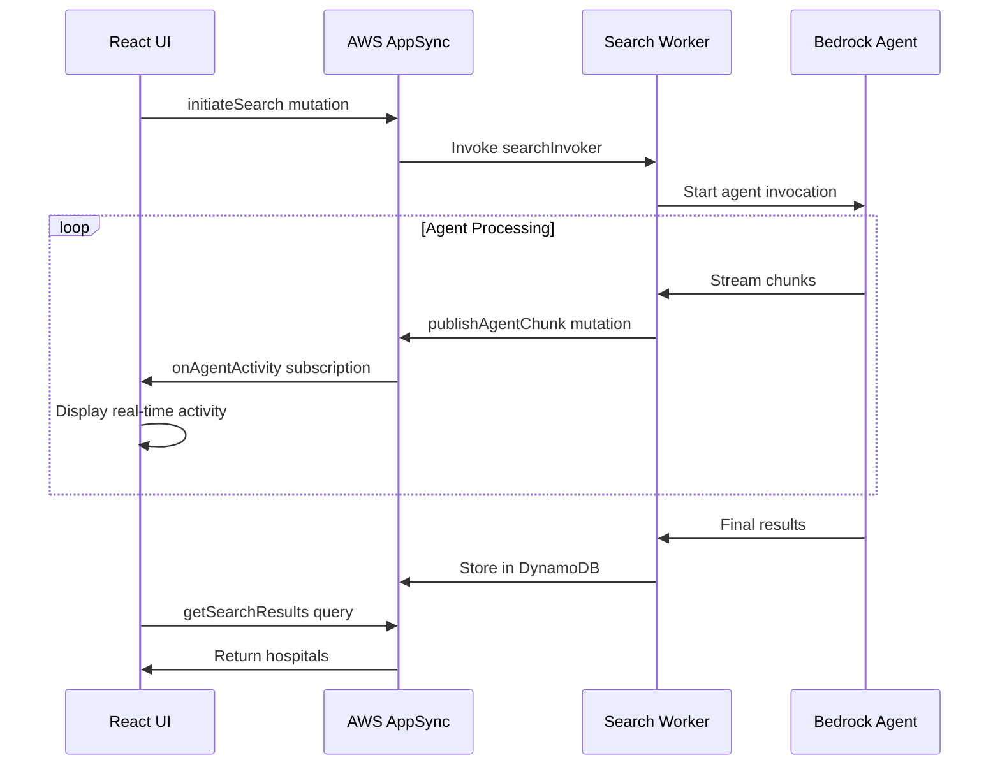

# Hospital Review Platform - Frontend Application

A modern React-based web application for searching hospitals, viewing detailed information, and submitting verified medical reviews with AI-powered insights.

## Technology Stack

- **Framework**: React 18.3 with TypeScript
- **Build Tool**: Vite 6.3
- **Styling**: Tailwind CSS 4.1 with shadcn/ui components
- **Routing**: React Router v6
- **Authentication**: AWS Cognito with OIDC (react-oidc-context)
- **API Integration**: 
  - REST API via AWS API Gateway
  - GraphQL via AWS AppSync (real-time streaming)
  - AWS Amplify for AppSync client
- **Maps**: MapLibre GL (AWS Location Service)
- **UI Components**: Radix UI primitives + shadcn/ui
- **Animations**: Motion (Framer Motion)
- **State Management**: React Context API

## Project Structure

```
app/
├── src/
│   ├── app/
│   │   ├── components/          # Reusable UI components
│   │   │   ├── ui/             # shadcn/ui base components
│   │   │   ├── review-steps/   # Multi-step review form components
│   │   │   ├── AgentActivityStream.tsx
│   │   │   ├── DoctorCard.tsx
│   │   │   ├── HospitalCard.tsx
│   │   │   ├── HospitalMap.tsx
│   │   │   ├── Layout.tsx
│   │   │   └── ...
│   │   ├── contexts/           # React Context providers
│   │   │   ├── AuthContext.tsx
│   │   │   └── SearchContext.tsx
│   │   ├── data/               # Mock data and types
│   │   │   └── mockData.ts
│   │   ├── pages/              # Route page components
│   │   │   ├── Home.tsx
│   │   │   ├── HospitalDetail.tsx
│   │   │   ├── CreateReview.tsx
│   │   │   ├── PastReviews.tsx
│   │   │   ├── MyDocuments.tsx
│   │   │   └── MyDetails.tsx
│   │   ├── services/           # API integration layer
│   │   │   ├── api.ts          # REST API client
│   │   │   ├── appsync.ts      # AppSync GraphQL client
│   │   │   └── reviewApi.ts    # Review submission API
│   │   ├── App.tsx             # Root application component
│   │   └── routes.tsx          # Route configuration
│   ├── imports/                # External schema/docs
│   ├── styles/                 # Global styles and fonts
│   └── main.tsx                # Application entry point
├── amplify/                    # AWS Amplify configuration
├── dist/                       # Build output
├── guidelines/                 # Development guidelines
├── index.html                  # HTML entry point
├── package.json
├── tsconfig.json
├── vite.config.ts
└── .env.example                # Environment variables template
```

## Key Features

### 1. AI-Powered Hospital Search
- Natural language search with real-time streaming responses
- AppSync GraphQL subscriptions for live agent activity
- Async search flow with polling for results
- Location-based search with geolocation support
- AI-generated summaries and recommendations

### 2. Hospital Details
- Comprehensive hospital information
- Doctor profiles with AI reviews
- Patient reviews and ratings
- Insurance coverage information
- Interactive maps with AWS Location Service
- Cost range estimates

### 3. Verified Review Submission
- Multi-step review workflow (4 steps)
- Document upload and verification:
  - Hospital bills (Textract + Comprehend)
  - Insurance claims (Textract + Comprehend)
  - Medical records (Textract + Comprehend Medical)
- AWS Step Functions for document processing
- S3 pre-signed URLs for secure uploads
- AI-powered review generation with Bedrock

### 4. User Dashboard
- Past reviews management
- Document library
- User profile management
- Authentication with AWS Cognito

## Environment Configuration

Create a `.env.local` file based on `.env.example`:

```bash
# AWS API Gateway Configuration
VITE_API_BASE_URL=https://your-api-id.execute-api.us-east-1.amazonaws.com

# AWS Location Service Configuration
VITE_AWS_LOCATION_API_KEY=your_api_key_here
VITE_AWS_LOCATION_REGION=us-east-1
VITE_AWS_LOCATION_MAP_STYLE=Standard
VITE_AWS_LOCATION_COLOR_SCHEME=Light

# AWS AppSync Configuration (for real-time streaming)
VITE_APPSYNC_ENDPOINT=https://your-api-id.appsync-api.us-east-1.amazonaws.com/graphql
VITE_APPSYNC_REGION=us-east-1
VITE_APPSYNC_API_KEY=da2-your-api-key-here

# AWS Cognito Configuration
VITE_COGNITO_AUTHORITY=https://cognito-idp.us-east-1.amazonaws.com/us-east-1_XXXXXXXXX
VITE_COGNITO_CLIENT_ID=your-client-id
VITE_REDIRECT_URI=http://localhost:5173
VITE_LOGOUT_URI=http://localhost:5173
```

## Development Setup

### Prerequisites
- Node.js 18+ 
- npm or pnpm

### Installation

```bash
# Navigate to app directory
cd app

# Install dependencies
npm install

# Copy environment variables
cp .env.example .env.local
# Edit .env.local with your AWS credentials

# Start development server
npm run dev
```

The application will be available at `http://localhost:5173`

### Build for Production

```bash
npm run build
```

Build output will be in the `dist/` directory.

## Architecture Overview

### Authentication Flow
1. User clicks "Sign In" → redirects to Cognito Hosted UI
2. User authenticates → Cognito redirects back with authorization code
3. OIDC client exchanges code for tokens
4. `AuthContext` provides user info and `customerId` (Cognito sub) throughout app

### Search Flow (AppSync Streaming)



### Review Submission Flow

```mermaid
graph LR
    A[Upload Document] --> B[POST /reviews/presign]
    B --> C[PUT to S3 Pre-signed URL]
    C --> D[POST /reviews/process-document]
    D --> E[Step Functions Workflow]
    E --> F[Textract Extraction]
    F --> G[Comprehend/Comprehend Medical]
    G --> H[Return Extracted Data]
    H --> I[POST /reviews]
    I --> J[Bedrock AI Review]
    J --> K[Store in DynamoDB]
```



## Core Components

### Pages

- **Home.tsx**: Search interface with real-time agent activity streaming
- **HospitalDetail.tsx**: Detailed hospital view with doctors, reviews, and map
- **CreateReview.tsx**: Multi-step review submission workflow
- **PastReviews.tsx**: User's review history
- **MyDocuments.tsx**: Document library with download capability
- **MyDetails.tsx**: User profile management

### Key Components

- **AgentActivityStream.tsx**: Real-time display of AI agent processing
- **HospitalCard.tsx**: Hospital search result card
- **DoctorCard.tsx**: Doctor profile card
- **HospitalMap.tsx**: Interactive map with MapLibre GL
- **Layout.tsx**: Main layout with navigation
- **FileUploadWithVerification.tsx**: Document upload with drag-and-drop

### Review Steps

- **Step1HospitalSelection.tsx**: Hospital and doctor selection
- **Step2Insurance.tsx**: Insurance information and claim upload
- **Step3MedicalRecords.tsx**: Medical record upload and extraction
- **Step4ReviewSubmission.tsx**: Review text and final submission

### Contexts

- **AuthContext.tsx**: Authentication state and user information
- **SearchContext.tsx**: Search state management (hospitals, AI summary, streaming)

### Services

- **api.ts**: REST API client for hospital search and data
- **appsync.ts**: AppSync GraphQL client for real-time streaming
- **reviewApi.ts**: Review submission and document processing API

## API Integration

### REST API (API Gateway)

```typescript
// Search hospitals
const { hospitals, searchId } = await searchHospitalsAPI(query, customerId);

// Get hospital details
const hospital = await getHospitalByIdAPI(hospitalId);

// Get hospital doctors (lazy loading)
const doctors = await getHospitalDoctorsAPI(hospitalId, searchId);
```

### AppSync GraphQL (Real-time)

```typescript
// Initiate search
const { searchId } = await initiateSearch(query, customerId, userLocation);

// Subscribe to agent activity
const subscription = subscribeToAgentActivity(
  searchId,
  (chunk) => console.log(chunk.chunk),
  (error) => console.error(error)
);

// Get final results
const results = await getSearchResults(searchId);
```

### Review API

```typescript
// Validate hospital bill
const result = await validateDocument(file, customerId);

// Validate insurance claim
const claimResult = await validateInsuranceClaim(file, customerId);

// Extract medical data
const { extractedData, documentIds } = await extractMedicalData(files, customerId);

// Submit review
const { reviewId } = await submitReview(reviewData);

// Get user reviews
const reviews = await getReviewsByCustomer(customerId);

// Get user documents
const documents = await getUserDocuments(customerId);
```

## State Management

The application uses React Context API for global state:

### AuthContext
- User authentication state
- Cognito user information
- `customerId` (Cognito sub) for API calls
- Sign in/out methods

### SearchContext
- Search query and results
- AI summary
- Agent activity stream
- Loading states
- Search ID for lazy loading

## Styling

### Tailwind CSS
- Utility-first CSS framework
- Custom theme configuration
- Responsive design utilities

### shadcn/ui Components
- Pre-built accessible components
- Radix UI primitives
- Customizable with Tailwind

### Custom Styles
- `styles/index.css`: Global styles
- `styles/fonts.css`: Custom fonts
- `styles/theme.css`: Theme variables
- `styles/tailwind.css`: Tailwind directives

## Testing

Currently, the application does not have automated tests. Consider adding:
- Unit tests with Vitest
- Component tests with React Testing Library
- E2E tests with Playwright

## Deployment

### AWS Amplify Hosting

The application is configured for AWS Amplify hosting:

```yaml
# amplify.yml
version: 1
frontend:
  phases:
    preBuild:
      commands:
        - npm ci
    build:
      commands:
        - npm run build
  artifacts:
    baseDirectory: dist
    files:
      - '**/*'
  cache:
    paths:
      - node_modules/**/*
```

### Manual Deployment

```bash
# Build the application
npm run build

# Deploy dist/ folder to your hosting provider
# (S3 + CloudFront, Netlify, Vercel, etc.)
```

## Performance Considerations

- **Code Splitting**: React Router handles route-based code splitting
- **Lazy Loading**: Doctors are loaded on-demand per hospital
- **Image Optimization**: Use appropriate image formats and sizes
- **API Caching**: Consider implementing client-side caching for search results
- **Bundle Size**: Monitor with `npm run build` and optimize imports

## Security

- **Authentication**: AWS Cognito with OIDC
- **API Security**: API Gateway with Cognito authorizer
- **Document Upload**: Pre-signed S3 URLs (no direct S3 access)
- **Environment Variables**: Never commit `.env.local` to version control
- **HTTPS**: Always use HTTPS in production

## Troubleshooting

### Common Issues

**Issue**: "customerId is customer_unknown"
- **Solution**: Ensure user is authenticated before making API calls. Use `useAuth()` hook to get `customerId`.

**Issue**: AppSync subscription not receiving messages
- **Solution**: Check AppSync API key and endpoint in `.env.local`. Verify subscription is active.

**Issue**: Document upload fails
- **Solution**: Check S3 bucket permissions and CORS configuration. Verify pre-signed URL is not expired.

**Issue**: Map not displaying
- **Solution**: Verify AWS Location Service API key and region in `.env.local`.

## Contributing

1. Follow the existing code structure and naming conventions
2. Use TypeScript for type safety
3. Follow React best practices (hooks, functional components)
4. Keep components small and focused
5. Document complex logic with comments
6. Test your changes thoroughly

## Related Documentation

- [Main Project README](../README.md)
- [AWS Lambda Functions](../aws/lambda/)
- [AWS AppSync Configuration](../aws/appsync/)
- [AWS Step Functions](../aws/step-functions/)
- [API Integration Guide](src/api/API_INTEGRATION_GUIDE.md)
- [AppSync Integration Guide](src/app/services/APPSYNC_INTEGRATION.md)

## License

This project is part of the AWS Hackathon 2026 submission.
