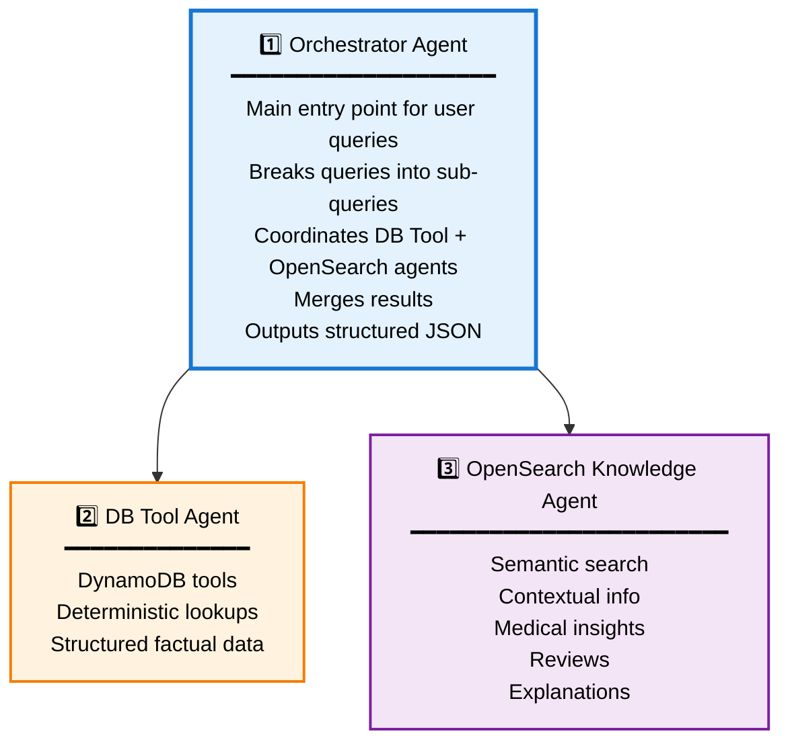

# AWS Bedrock Agents - Healthcare Search System

## New Architecture (3-Agent System)

### Agent Overview



---

## Agent Descriptions

### 1️⃣ Orchestrator Agent
**File**: `orchestrator-agent-ui-fields.md`

**Purpose**: Main coordinator that handles user queries

**Responsibilities**:
- Analyze and break down user queries
- Delegate to DB Tool Agent for factual data
- Delegate to OpenSearch Agent for context
- Merge results from both agents
- Format structured JSON responses
- Provide user-friendly conversational responses

**Agent Collaboration**: ENABLED
- Calls DB Tool Agent
- Calls OpenSearch Knowledge Agent

---

### 2️⃣ DB Tool Agent
**File**: `db-tool-agent-ui-fields.md`

**Purpose**: Database query executor

**Responsibilities**:
- Execute structured DynamoDB queries
- Perform deterministic lookups
- Return factual data (hospitals, doctors, costs, ratings)
- NO interpretation or recommendations
- Just raw data retrieval

**Action Group**: `health_search`
- 7 DynamoDB query functions
- Filters by affordability, insurance, costs, ratings, specializations

---

### 3️⃣ OpenSearch Knowledge Agent
**File**: `opensearch-knowledge-agent-ui-fields.md`

**Purpose**: Semantic search and contextual information

**Responsibilities**:
- Perform semantic searches in OpenSearch knowledge base
- Provide contextual information
- Explain medical procedures
- Share hospital reviews and insights
- Answer general healthcare questions
- Supplement factual data with explanations

**Knowledge Base**: OpenSearch Serverless
- Hospital information documents
- Medical procedure guides
- Patient reviews
- Healthcare articles

---

## Deployment Order

1. **Create DB Tool Agent** (with action group pointing to hospitalSearchFunction Lambda)
2. **Create OpenSearch Knowledge Agent** (with OpenSearch knowledge base)
3. **Create Orchestrator Agent** (with Agent Collaboration enabled, pointing to agents 1 & 2)

---

## Configuration Files

### DB Tool Agent
- `db-tool-agent-ui-fields.md` - AWS Console configuration
- Action group: `health_search`
- Lambda: `hospitalSearchFunction`

### OpenSearch Knowledge Agent  
- `opensearch-knowledge-agent-ui-fields.md` - AWS Console configuration
- Knowledge base: OpenSearch Serverless (configure separately)

### Orchestrator Agent
- `orchestrator-agent-ui-fields.md` - AWS Console configuration
- Agent Collaboration: ENABLED
- Collaborators: DB Tool Agent + OpenSearch Knowledge Agent

---

## Example Query Flow

**User Query**: "I need affordable hospitals with good cardiologists"

1. **Orchestrator Agent** receives query
2. Breaks into sub-queries:
   - Factual: "affordable hospitals"
   - Factual: "hospitals with good cardiologists"
3. **Calls DB Tool Agent**:
   - `get_hospitals_by_affordability(0.6, 1.0)`
   - `get_hospitals_top_doctors_in_dept("Department of Cardiology", 4.0)`
4. **Calls OpenSearch Knowledge Agent**:
   - "What makes a good cardiologist?"
   - "Cardiology department information"
5. **Merges results**:
   - Combines hospital data from DB
   - Adds context from OpenSearch
   - Removes duplicates
   - Sorts by relevance
6. **Returns structured JSON**:
   ```json
   {
     "query": "affordable hospitals with good cardiologists",
     "results": {
       "hospitals": [...],
       "contextual_info": "..."
     },
     "summary": "Found 5 affordable hospitals with highly-rated cardiologists...",
     "recommendations": [...]
   }
   ```

---

## Files in This Directory

### Active Agent Configurations
- ✅ `db-tool-agent-ui-fields.md` - DB Tool Agent (DynamoDB queries)
- ✅ `orchestrator-agent-ui-fields.md` - Orchestrator Agent (main coordinator)
- ✅ `opensearch-knowledge-agent-ui-fields.md` - OpenSearch Knowledge Agent (semantic search)

### Action Groups
- `action-groups/` - Function definitions for DB Tool Agent
  - `all-functions.json` - All 7 functions
  - Individual function files (0-6)

### Legacy Files (Removed)
- ❌ `intent-agent-ui-fields.md` (renamed to db-tool-agent)
- ❌ `explanation-agent-ui-fields.md` (removed)
- ❌ `validator-agent-ui-fields.md` (removed)
- ❌ `dynamodb-tooling-agent.md` (removed)
- ❌ `search-lambda-agent.md` (removed)

---

## Key Differences from Old Architecture

### Old Architecture (5 agents)
- Search Lambda Agent
- Intent Agent
- DynamoDB Tooling Agent
- Explanation Agent
- Validator Agent

### New Architecture (3 agents)
- **Orchestrator Agent** (replaces Search Lambda + coordination logic)
- **DB Tool Agent** (replaces Intent + DynamoDB Tooling, focused on data only)
- **OpenSearch Knowledge Agent** (replaces Explanation + adds semantic search)

### Benefits
- ✅ Simpler architecture
- ✅ Clear separation of concerns
- ✅ Better semantic search with OpenSearch
- ✅ Easier to maintain and debug
- ✅ More scalable

---

## Next Steps

1. Deploy DB Tool Agent with `health_search` action group
2. Set up OpenSearch knowledge base and deploy OpenSearch Knowledge Agent
3. Deploy Orchestrator Agent with Agent Collaboration enabled
4. Test end-to-end query flow
5. Monitor and optimize

---

For detailed configuration instructions, see individual agent files.
