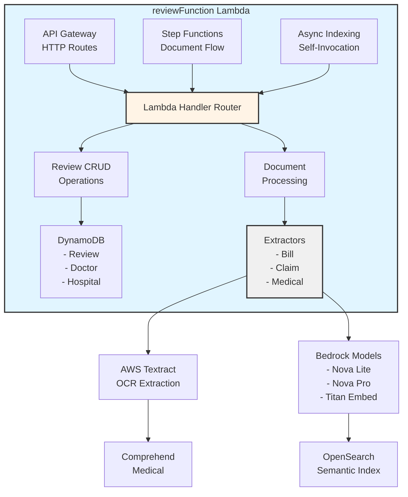

# Review Function Lambda

## Overview

The `reviewFunction` is a comprehensive AWS Lambda function that serves as the central hub for managing patient hospital reviews and processing medical documents. It handles the complete lifecycle of reviews including CRUD operations, document upload/processing, medical data extraction, and OpenSearch indexing for semantic search capabilities.

This function integrates with multiple AWS services including DynamoDB, S3, Textract, Comprehend Medical, Bedrock, Step Functions, and OpenSearch to provide an end-to-end document processing and review management system.

## Purpose

The reviewFunction serves three primary purposes:

1. **Review Management**: Complete CRUD operations for patient hospital reviews with support for doctor reviews, hospital reviews, payment information, and insurance claims
2. **Document Processing**: Automated extraction of structured data from medical documents (hospital bills, insurance claims, discharge summaries) using AI/ML services
3. **Semantic Search**: Indexing reviews into OpenSearch with embeddings for intelligent search and retrieval

## Architecture




## API Endpoints

### Document Management Routes

#### 1. Get User Documents
```
GET /reviews/documents?customerId=<id>
```
Returns all documents across all reviews for a specific customer.

**Query Parameters:**
- `customerId` (required): The Cognito sub (stable user ID)

**Response:**
```json
{
  "documents": [
    {
      "id": "documents/hospitalBills/customer_xxx_abc123.pdf",
      "name": "Cardiac Surgery - Payment Receipt",
      "type": "Payment Receipt",
      "date": "2024-03-15",
      "size": "2.3 MB",
      "hospital": "Apollo Hospital",
      "verified": true,
      "s3Key": "documents/hospitalBills/customer_xxx_abc123.pdf"
    }
  ],
  "count": 1
}
```

**Performance:** Uses CustomerIndex GSI for fast retrieval (O(1) lookup by customerId)

#### 2. Get Document Download URL
```
GET /reviews/documents/download?documentId=<s3Key>
```
Generates a pre-signed S3 GET URL for downloading a document.

**Query Parameters:**
- `documentId` (required): The S3 key of the document

**Response:**
```json
{
  "downloadUrl": "https://bucket.s3.amazonaws.com/key?X-Amz-...",
  "filename": "bill.pdf",
  "expiresIn": 300
}
```

**Expiration:** URLs are valid for 5 minutes

#### 3. Generate Pre-signed Upload URL
```
POST /reviews/presign
```
Generates a pre-signed S3 PUT URL for browser-to-S3 direct upload.

**Request Body:**
```json
{
  "customerId": "customer_id_06kzw",
  "filename": "hospital_bill.pdf",
  "documentType": "hospitalBill"
}
```

**Document Types:**
- `hospitalBill` → `documents/hospitalBills/`
- `insuranceClaim` → `documents/insuranceClaims/`
- `medicalRecord` → `documents/medicalRecords/`

**Response:**
```json
{
  "uploadUrl": "https://bucket.s3.amazonaws.com/key?X-Amz-...",
  "s3Key": "documents/hospitalBills/customer_id_06kzw_f3a9d812c441.pdf",
  "documentId": "documents/hospitalBills/customer_id_06kzw_f3a9d812c441.pdf",
  "expiresIn": 300
}
```

**Key Generation:** Uses SHA256(filename + epoch) for uniqueness

#### 4. Process Document
```
POST /reviews/process-document
```
Triggers the Step Functions document processing workflow (Sync Express).

**Request Body:**
```json
{
  "documentId": "documents/hospitalBills/customer_xxx_abc123.pdf",
  "s3Key": "documents/hospitalBills/customer_xxx_abc123.pdf",
  "documentType": "hospitalBill"
}
```

**Response (Hospital Bill):**
```json
{
  "valid": true,
  "payment": {
    "billNo": "BILL-79780",
    "totalBillAmount": "₹108599",
    "amountToBePayed": "₹34956",
    "description": "## Payment Summary\n..."
  },
  "documentId": "documents/hospitalBills/customer_xxx_abc123.pdf",
  "s3Url": "https://bucket.s3.amazonaws.com/key"
}
```

**Response (Insurance Claim):**
```json
{
  "valid": true,
  "claim": {
    "claimId": "CLM-528527",
    "originalBillAmount": "₹108599",
    "claimAmountApproved": "₹65583",
    "remainingAmountToBePaid": "₹43016",
    "description": "## Claim Settlement Summary\n..."
  },
  "payment": {
    "amountToBePayed": "₹43016"
  },
  "documentId": "documents/insuranceClaims/customer_xxx_def456.pdf",
  "s3Url": "https://bucket.s3.amazonaws.com/key"
}
```

**Response (Medical Record):**
```json
{
  "valid": true,
  "confidence": 0.8542,
  "extractedData": {
    "hospitalName": "Apollo Hospital",
    "doctorName": "Dr. Anand Pandey",
    "surgeryType": "Cardiac Bypass Surgery",
    "procedureDate": "2024-03-10",
    "diagnosis": "Coronary Artery Disease",
    "medications": ["Aspirin 75mg", "Atorvastatin 40mg"]
  },
  "purposeOfVisit": "Chest pain and shortness of breath",
  "documentId": "documents/medicalRecords/customer_xxx_ghi789.pdf",
  "s3Url": "https://bucket.s3.amazonaws.com/key"
}
```

**Document Validation:** Automatically classifies and validates document type using Bedrock before processing

#### 5. Delete Document
```
DELETE /reviews/documents
```
Permanently removes a document from S3.

**Request Body:**
```json
{
  "documentId": "documents/hospitalBills/customer_xxx_abc123.pdf"
}
```

**Response:**
```json
{
  "message": "Document 'documents/hospitalBills/customer_xxx_abc123.pdf' deleted from S3.",
  "documentId": "documents/hospitalBills/customer_xxx_abc123.pdf"
}
```


### Review CRUD Routes

#### 6. Create Review
```
POST /reviews
```
Creates a new review with payment description generated by Bedrock.

**Request Body:**
```json
{
  "hospitalId": "hospital_xxx_yyy",
  "doctorId": "doctor_abc_def",
  "customerId": "customer_id_06kzw",
  "policyId": "policy_123_456",
  "purposeOfVisit": "Cardiac surgery consultation",
  "doctorReview": {
    "doctorId": "doctor_abc_def",
    "rating": 5,
    "reviewTitle": "Excellent care",
    "reviewDetails": "Dr. Pandey was very thorough..."
  },
  "hospitalReview": {
    "rating": 4,
    "reviewTitle": "Good facilities",
    "reviewDetails": "Clean and well-maintained..."
  },
  "payment": {
    "billNo": "BILL-79780",
    "totalBillAmount": "₹108599",
    "amountToBePayed": "₹34956"
  },
  "claim": {
    "claimId": "CLM-528527",
    "claimAmountApproved": "₹65583",
    "remainingAmountToBePaid": "₹43016"
  },
  "documentIds": [
    "documents/hospitalBills/customer_xxx_abc123.pdf",
    "documents/insuranceClaims/customer_xxx_def456.pdf",
    "documents/medicalRecords/customer_xxx_ghi789.pdf"
  ],
  "extractedData": {
    "hospitalName": "Apollo Hospital",
    "doctorName": "Dr. Anand Pandey",
    "surgeryType": "Cardiac Bypass Surgery",
    "procedureDate": "2024-03-10",
    "diagnosis": "Coronary Artery Disease",
    "medications": ["Aspirin 75mg", "Atorvastatin 40mg"],
    "confidence": 0.8542
  }
}
```

**Response:**
```json
{
  "reviewId": "review_a1b2c3d4e5",
  "hospitalId": "hospital_xxx_yyy",
  "doctorId": "doctor_abc_def",
  "customerId": "customer_id_06kzw",
  "policyId": "policy_123_456",
  "purposeOfVisit": "Cardiac surgery consultation",
  "doctorReview": { ... },
  "hospitalReview": { ... },
  "payment": {
    "billNo": "BILL-79780",
    "totalBillAmount": "₹108599",
    "amountToBePayed": "₹34956",
    "description": "## Payment Summary\n\n**Bill No:** BILL-79780\n..."
  },
  "claim": { ... },
  "documentIds": [ ... ],
  "extractedData": { ... },
  "verified": 1,
  "createdAt": "2024-03-15 14:30:00"
}
```

**Automatic Processing:**
- Generates payment.description via Bedrock using payment, extractedData, and claim
- Sets verified=1 by default
- Generates unique reviewId with format `review_<10-char-hex>`
- Timestamps with UTC in format "YYYY-MM-DD HH:MM:SS"

**Background Indexing:** Asynchronously invokes itself to index the review into OpenSearch (fire-and-forget)

#### 7. Get Review
```
GET /reviews/{reviewId}
```
Retrieves a single review by ID.

**Response:**
```json
{
  "reviewId": "review_a1b2c3d4e5",
  "hospitalId": "hospital_xxx_yyy",
  "doctorId": "doctor_abc_def",
  "customerId": "customer_id_06kzw",
  ...
}
```

#### 8. List Reviews
```
GET /reviews?customerId=<id>&hospitalId=<id>&doctorId=<id>&policyId=<id>&limit=20&lastKey=<token>
```
Returns a paginated list of reviews with intelligent query optimization.

**Query Parameters:**
- `customerId` (optional): Filter by customer - uses CustomerIndex GSI (fastest)
- `hospitalId` (optional): Filter by hospital - uses HospitalIdIndex GSI (fast)
- `doctorId` (optional): Filter by doctor
- `policyId` (optional): Filter by insurance policy
- `limit` (optional): Max items per page (default: 20, max: 100)
- `lastKey` (optional): Pagination token from previous response

**Performance Strategy:**
1. **WITH customerId**: Uses CustomerIndex GSI (O(1) lookup)
2. **WITH hospitalId (no customerId)**: Uses HospitalIdIndex GSI (O(1) lookup)
3. **WITHOUT indexed fields**: Uses scan with filters (slower)

Multiple filters can be combined with AND logic.

**Response:**
```json
{
  "items": [
    {
      "reviewId": "review_a1b2c3d4e5",
      "hospitalId": "hospital_xxx_yyy",
      ...
    }
  ],
  "count": 20,
  "lastKey": "{\"reviewId\":\"review_xyz\"}"
}
```

**Pagination:** Include `lastKey` from response in next request to fetch more results

#### 9. Update Review
```
PUT /reviews/{reviewId}
```
Updates specific fields of an existing review.

**Updatable Fields:**
- `purposeOfVisit`
- `doctorReview`
- `hospitalReview`
- `payment`
- `claim`
- `extractedData`
- `documentIds`
- `hospitalId`
- `doctorId`
- `policyId`
- `verified`

**Request Body:**
```json
{
  "verified": 1,
  "payment": {
    "billNo": "BILL-79780",
    "totalBillAmount": "₹108599",
    "amountToBePayed": "₹30000"
  }
}
```

**Response:**
```json
{
  "reviewId": "review_a1b2c3d4e5",
  "verified": 1,
  "payment": {
    "billNo": "BILL-79780",
    "totalBillAmount": "₹108599",
    "amountToBePayed": "₹30000",
    "description": "..."
  },
  ...
}
```

**Validation:** Returns 404 if review doesn't exist, 400 if no updatable fields provided

#### 10. Delete Review
```
DELETE /reviews/{reviewId}
```
Permanently deletes a review from DynamoDB.

**Response:**
```json
{
  "message": "Review 'review_a1b2c3d4e5' deleted.",
  "deleted": {
    "reviewId": "review_a1b2c3d4e5",
    ...
  }
}
```

**Note:** Does NOT delete associated S3 documents - use DELETE /reviews/documents separately


## Document Processing Workflow

### Step Functions Integration

The reviewFunction integrates with AWS Step Functions (Sync Express Workflow) for document processing. The workflow is triggered by `POST /reviews/process-document` and executes synchronously.

```
┌─────────────────────────────────────────────────────────────────────┐
│                  Document Processing Workflow                        │
└─────────────────────────────────────────────────────────────────────┘
                              │
                              ▼
                    ┌──────────────────┐
                    │  1. Textract     │
                    │  Extract         │
                    │  (OCR)           │
                    └──────────────────┘
                              │
                              ▼
                    ┌──────────────────┐
                    │  2. Document     │
                    │  Classification  │
                    │  (Bedrock)       │
                    └──────────────────┘
                              │
                ┌─────────────┼─────────────┐
                │             │             │
                ▼             ▼             ▼
    ┌──────────────┐  ┌──────────────┐  ┌──────────────┐
    │  3a. Bill    │  │  3b. Claim   │  │  3c. Medical │
    │  Extraction  │  │  Extraction  │  │  Extraction  │
    │  (Bedrock)   │  │  (Bedrock)   │  │  (Bedrock +  │
    │              │  │              │  │  Comprehend)  │
    └──────────────┘  └──────────────┘  └──────────────┘
                │             │             │
                └─────────────┼─────────────┘
                              ▼
                    ┌──────────────────┐
                    │  4. Return       │
                    │  Structured      │
                    │  Data            │
                    └──────────────────┘
```

### Action Handlers

The Lambda function exposes internal action handlers that are called by Step Functions:

#### 1. textract_extract
Extracts raw text, key-value pairs, and tables from a document using AWS Textract.

**Input:**
```json
{
  "action": "textract_extract",
  "s3Bucket": "choco-warriors-db-synthetic-data-us",
  "s3Key": "documents/hospitalBills/customer_xxx_abc123.pdf"
}
```

**Output:**
```json
{
  "raw_text": "Apollo Hospital\nBill No: BILL-79780\nTotal: ₹108599...",
  "key_values": {
    "Bill No": "BILL-79780",
    "Total Amount": "₹108599",
    "Patient Name": "John Doe"
  },
  "tables": [
    ["Service", "Amount"],
    ["Surgery", "₹80000"],
    ["Room Charges", "₹15000"]
  ]
}
```

#### 2. extract_bill
Extracts payment fields from a hospital bill using Bedrock.

**Input:**
```json
{
  "action": "extract_bill",
  "raw_text": "...",
  "key_values": { ... },
  "tables": [ ... ]
}
```

**Output:**
```json
{
  "valid": true,
  "reason": "",
  "payment": {
    "billNo": "BILL-79780",
    "totalBillAmount": "₹108599",
    "amountToBePayed": "₹34956",
    "description": "## Payment Summary\n\n**Bill No:** BILL-79780..."
  }
}
```

**Document Validation:** Returns `valid: false` if document is not a hospital bill

#### 3. extract_claim
Extracts insurance claim fields from a claim settlement document using Bedrock.

**Input:**
```json
{
  "action": "extract_claim",
  "raw_text": "...",
  "key_values": { ... },
  "tables": [ ... ]
}
```

**Output:**
```json
{
  "valid": true,
  "reason": "",
  "claim": {
    "claimId": "CLM-528527",
    "originalBillAmount": "₹108599",
    "claimAmountApproved": "₹65583",
    "remainingAmountToBePaid": "₹43016",
    "description": "## Claim Settlement Summary\n..."
  },
  "payment": {
    "amountToBePayed": "₹43016"
  }
}
```

**Payment Patch:** Returns payment.amountToBePayed so the caller can update the patient's true out-of-pocket cost

#### 4. extract_medical
Extracts medical record fields using Comprehend Medical + Bedrock.

**Input:**
```json
{
  "action": "extract_medical",
  "raw_text": "...",
  "key_values": { ... },
  "tables": [ ... ]
}
```

**Output:**
```json
{
  "valid": true,
  "reason": "",
  "confidence": 0.8542,
  "extractedData": {
    "hospitalName": "Apollo Hospital",
    "doctorName": "Dr. Anand Pandey",
    "surgeryType": "Cardiac Bypass Surgery",
    "procedureDate": "2024-03-10",
    "diagnosis": "Coronary Artery Disease",
    "medications": ["Aspirin 75mg", "Atorvastatin 40mg"]
  },
  "purposeOfVisit": "Chest pain and shortness of breath"
}
```

**Confidence Score:**
- Uses Comprehend Medical entity scores when available
- Falls back to Bedrock extraction completeness (fraction of key fields populated)

#### 5. index_review
Indexes a review into OpenSearch with semantic embeddings (async invocation).

**Input:**
```json
{
  "action": "index_review",
  "reviewId": "review_a1b2c3d4e5",
  "doctorId": "doctor_abc_def",
  "hospitalId": "hospital_xxx_yyy"
}
```

**Process:**
1. Fetches review, doctor, and hospital records from DynamoDB
2. Builds combinedText from all meaningful text fields
3. Generates 1024-dim embedding via Bedrock Titan Embed v2
4. PUTs combined document into OpenSearch

**Output:**
```json
{
  "indexed": true,
  "reviewId": "review_a1b2c3d4e5",
  "result": "created"
}
```


## Data Models

### Review Schema (DynamoDB)

```python
{
  "reviewId":        str,              # PK, format: "review_<10-char-hex>"
  "hospitalId":      str,              # FK to Hospital table
  "doctorId":        str,              # FK to Doctor table
  "customerId":      str,              # Cognito sub (stable user ID)
  "policyId":        str | None,       # FK to InsurancePolicy table (optional)
  "purposeOfVisit":  str,              # Primary reason for visit
  "doctorReview": {
    "doctorId":      str,
    "rating":        int,              # 1-5 stars
    "reviewTitle":   str,
    "reviewDetails": str
  },
  "hospitalReview": {
    "rating":        int,              # 1-5 stars
    "reviewTitle":   str,
    "reviewDetails": str
  },
  "payment": {
    "billNo":          str,            # e.g. "BILL-79780"
    "totalBillAmount": str,            # e.g. "₹108599"
    "amountToBePayed": str,            # e.g. "₹34956"
    "description":     str             # Markdown payment summary (Bedrock-generated)
  },
  "claim": {                           # Optional - only when insurance claim exists
    "claimId":                 str,    # e.g. "CLM-528527"
    "originalBillAmount":      str,
    "claimAmountApproved":     str,    # Amount insurer paid to hospital
    "remainingAmountToBePaid": str,    # Patient's out-of-pocket
    "description":             str     # Markdown claim summary (Bedrock-generated)
  } | None,
  "documentIds":     list[str],        # S3 keys of uploaded documents
  "extractedData": {
    "hospitalName":  str,              # Human-readable name (NOT machine ID)
    "doctorName":    str,              # e.g. "Dr. Anand Pandey"
    "surgeryType":   str,
    "procedureDate": str,              # YYYY-MM-DD format
    "diagnosis":     str,
    "medications":   list[str],        # e.g. ["Aspirin 75mg", "Atorvastatin 40mg"]
    "confidence":    float             # 0.0-1.0 extraction confidence score
  },
  "verified":        int,              # 1 = verified, 0 = unverified
  "createdAt":       str               # "YYYY-MM-DD HH:MM:SS" UTC
}
```

### DynamoDB Indexes

#### Primary Key
- **Partition Key:** `reviewId`

#### Global Secondary Indexes (GSI)

1. **CustomerIndex** (for fast customer lookups)
   - **Partition Key:** `customerId`
   - **Use Case:** `GET /reviews?customerId=<id>` and `GET /reviews/documents?customerId=<id>`
   - **Performance:** O(1) lookup by customer

2. **HospitalIdIndex** (for fast hospital lookups)
   - **Partition Key:** `hospitalId`
   - **Use Case:** `GET /reviews?hospitalId=<id>`
   - **Performance:** O(1) lookup by hospital

See `GSI_OPTIMIZATION_SUMMARY.md` for detailed performance analysis.

### OpenSearch Document Schema

```json
{
  "reviewId": "review_a1b2c3d4e5",
  "hospitalId": "hospital_xxx_yyy",
  "doctorId": "doctor_abc_def",
  "customerId": "customer_id_06kzw",
  "purposeOfVisit": "Cardiac surgery consultation",
  "doctorReview": { ... },
  "hospitalReview": { ... },
  "payment": { ... },
  "claim": { ... },
  "documentIds": [ ... ],
  "extractedData": { ... },
  "verified": 1,
  "createdAt": "2024-03-15 14:30:00",
  
  "_doctor": {
    "doctorId": "doctor_abc_def",
    "name": "Dr. Anand Pandey",
    "specialisation": "Cardiology",
    "about": "...",
    "qualifications": "MBBS, MD, DM",
    "imageUrl": "https://..."
  },
  
  "_hospital": {
    "hospitalId": "hospital_xxx_yyy",
    "name": "Apollo Hospital",
    "about": "...",
    "location": {
      "city": "Mumbai",
      "state": "Maharashtra",
      "country": "India"
    },
    "services": ["Cardiology", "Neurology", ...],
    "imageUrl": "https://..."
  },
  
  "combinedText": "Cardiac surgery consultation | Excellent care | Dr. Pandey was very thorough... | Apollo Hospital | Mumbai | Maharashtra | India | Cardiology, Neurology...",
  
  "contentVector": [0.123, -0.456, 0.789, ...]  // 1024-dim Titan Embed v2 vector
}
```

**combinedText:** Flattened text from review, doctor, and hospital for full-text search
**contentVector:** Dense embedding for semantic/k-NN search


## Environment Variables

### Required Variables

| Variable | Description | Default | Example |
|----------|-------------|---------|---------|
| `TABLE_NAME` | DynamoDB Review table name | `Review` | `Review` |
| `DOCTOR_TABLE_NAME` | DynamoDB Doctor table name | `Doctor` | `Doctor` |
| `HOSPITAL_TABLE_NAME` | DynamoDB Hospital table name | `Hospital` | `Hospital` |
| `S3_BUCKET` | S3 bucket for document storage | `choco-warriors-db-synthetic-data-us` | `my-healthcare-docs` |
| `STEP_FUNCTION_ARN` | ARN of document processing workflow | (required) | `arn:aws:states:us-east-1:123456789012:stateMachine:DocumentProcessingWorkflowUS` |
| `OPENSEARCH_ENDPOINT` | OpenSearch domain HTTPS URL | (required) | `https://search-myapp-xxx.us-east-1.es.amazonaws.com` |
| `FUNCTION_NAME` | This Lambda's function name (for async self-invocation) | `reviewFunction` | `reviewFunction` |

### Optional Variables

| Variable | Description | Default |
|----------|-------------|---------|
| `DYNAMODB_REGION` | Region where DynamoDB tables live | `eu-north-1` |
| `AWS_REGION` | AWS region (auto-injected by Lambda) | `us-east-1` |
| `BEDROCK_MODEL_ID` | Bedrock model for general tasks | `amazon.nova-lite-v1:0` |
| `MEDICAL_MODEL_ID` | Bedrock model for medical extraction | `amazon.nova-pro-v1:0` |
| `BEDROCK_EMBEDDING_MODEL_ID` | Bedrock embedding model | `amazon.titan-embed-text-v2:0` |
| `OPENSEARCH_INDEX` | OpenSearch index name | `reviews` |
| `OPENSEARCH_SERVICE_NAME` | `es` for managed, `aoss` for serverless | `es` |

### Bedrock Model Selection

**General Tasks (BEDROCK_MODEL_ID):**
- Default: `amazon.nova-lite-v1:0` - Fast, cheap, no marketplace subscription required
- Alternative: `anthropic.claude-3-sonnet-20240229-v1:0` - Higher quality, requires marketplace subscription

**Medical Extraction (MEDICAL_MODEL_ID):**
- Default: `amazon.nova-pro-v1:0` - High accuracy, no marketplace subscription required
- Alternative: `amazon.nova-premier-v1:0` - Highest capability
- Alternative: `us.amazon.nova-pro-v1:0` - Cross-region inference

**Embedding (BEDROCK_EMBEDDING_MODEL_ID):**
- Default: `amazon.titan-embed-text-v2:0` - 1024-dim vectors
- Note: Titan Embed does NOT support Converse API, uses invoke_model directly

## Configuration

### IAM Permissions

The Lambda execution role requires the following permissions:

```json
{
  "Version": "2012-10-17",
  "Statement": [
    {
      "Effect": "Allow",
      "Action": [
        "dynamodb:GetItem",
        "dynamodb:PutItem",
        "dynamodb:UpdateItem",
        "dynamodb:DeleteItem",
        "dynamodb:Query",
        "dynamodb:Scan"
      ],
      "Resource": [
        "arn:aws:dynamodb:*:*:table/Review",
        "arn:aws:dynamodb:*:*:table/Review/index/*",
        "arn:aws:dynamodb:*:*:table/Doctor",
        "arn:aws:dynamodb:*:*:table/Hospital"
      ]
    },
    {
      "Effect": "Allow",
      "Action": [
        "s3:GetObject",
        "s3:PutObject",
        "s3:DeleteObject",
        "s3:HeadObject"
      ],
      "Resource": "arn:aws:s3:::choco-warriors-db-synthetic-data-us/*"
    },
    {
      "Effect": "Allow",
      "Action": [
        "textract:AnalyzeDocument"
      ],
      "Resource": "*"
    },
    {
      "Effect": "Allow",
      "Action": [
        "comprehendmedical:DetectEntitiesV2"
      ],
      "Resource": "*"
    },
    {
      "Effect": "Allow",
      "Action": [
        "bedrock:InvokeModel",
        "bedrock:Converse"
      ],
      "Resource": [
        "arn:aws:bedrock:*::foundation-model/amazon.nova-lite-v1:0",
        "arn:aws:bedrock:*::foundation-model/amazon.nova-pro-v1:0",
        "arn:aws:bedrock:*::foundation-model/amazon.titan-embed-text-v2:0"
      ]
    },
    {
      "Effect": "Allow",
      "Action": [
        "states:StartSyncExecution"
      ],
      "Resource": "arn:aws:states:*:*:stateMachine:DocumentProcessingWorkflowUS"
    },
    {
      "Effect": "Allow",
      "Action": [
        "lambda:InvokeFunction"
      ],
      "Resource": "arn:aws:lambda:*:*:function:reviewFunction"
    },
    {
      "Effect": "Allow",
      "Action": [
        "es:ESHttpPut",
        "es:ESHttpGet"
      ],
      "Resource": "arn:aws:es:*:*:domain/*/reviews/*"
    }
  ]
}
```

### Lambda Configuration

**Recommended Settings:**
- **Memory:** 512 MB (minimum for Bedrock/Textract operations)
- **Timeout:** 60 seconds (API routes), 300 seconds (Step Functions actions)
- **Concurrency:** Reserved concurrency of 10-20 for production
- **Environment:** Python 3.11 or later

### API Gateway Integration

**Integration Type:** Lambda Proxy Integration

**CORS Headers:** Automatically included in all responses
```json
{
  "Access-Control-Allow-Origin": "*",
  "Content-Type": "application/json"
}
```

**Route Configuration:**
```
GET    /reviews
POST   /reviews
GET    /reviews/{reviewId}
PUT    /reviews/{reviewId}
DELETE /reviews/{reviewId}
POST   /reviews/presign
POST   /reviews/process-document
GET    /reviews/documents
GET    /reviews/documents/download
DELETE /reviews/documents
```


## Document Extractors

The reviewFunction uses specialized extractor modules for each document type:

### bill_extractor.py

Extracts payment fields from hospital bills using Bedrock Claude/Nova.

**Features:**
- Semantic field extraction (no regex, handles label variations)
- Preserves ₹ symbol in amounts
- Removes commas from numbers (₹1,08,599 → ₹108599)
- Generates Markdown payment summary from raw bill text
- Fallback: uses totalBillAmount when amountToBePayed not found (no insurance case)

**Extracted Fields:**
- `billNo`: Bill/invoice identifier
- `totalBillAmount`: Total including all charges
- `amountToBePayed`: Patient's share after insurance
- `description`: Markdown payment summary

**Label Variations Handled:**
- Bill No: Bill No, Invoice No, Receipt No, Bill ID, Bill Number
- Total: Total, Grand Total, Gross Amount, Total Bill, Total Charges, Sub Total+GST
- Patient Payable: Balance Due, Net Payable, Amount Due, Patient Share, Outstanding, Patient Responsibility

### claim_extractor.py

Extracts insurance claim settlement fields using Bedrock Claude/Nova.

**Features:**
- Semantic extraction from TPA/insurer settlement letters
- Handles 100% coverage case (remainingAmountToBePaid = ₹0)
- Generates Markdown claim settlement summary
- Returns payment patch for updating patient's true out-of-pocket cost

**Extracted Fields:**
- `claimId`: Claim reference/TPA reference number
- `originalBillAmount`: Original hospital bill total
- `claimAmountApproved`: Amount insurer paid to hospital
- `remainingAmountToBePaid`: Patient's out-of-pocket balance
- `description`: Markdown claim summary

**Label Variations Handled:**
- Claim ID: Claim No, Claim ID, Claim Reference, TPA Ref No
- Approved Amount: Sanctioned Amount, Approved Amount, Settlement Amount, Payable by Insurer
- Patient Share: Co-pay, Patient Liability, Balance, Deductible, Amount Not Covered

### medical_extractor.py

Extracts structured medical record fields using Comprehend Medical + Bedrock.

**Two-Stage Process:**
1. **Comprehend Medical:** Detects clinical entities (medications, conditions, procedures)
2. **Bedrock Nova Pro:** Interprets entities + raw text to extract structured fields

**Features:**
- High-accuracy medical extraction using Nova Pro (no marketplace subscription)
- Confidence scoring from Comprehend Medical entity scores
- Fallback to Bedrock completeness when CM returns no entities
- Validates hospitalName is human-readable (not machine ID)
- Extracts doctorName in format "Dr. FirstName LastName" (stops at name)

**Extracted Fields:**
- `hospitalName`: Full human-readable hospital name
- `doctorName`: Consulting doctor's full name with title
- `surgeryType`: Procedure or surgery performed
- `procedureDate`: Date in YYYY-MM-DD format
- `diagnosis`: Primary diagnosis or medical condition
- `medications`: Array of medication strings with dosage
- `confidence`: Mean Comprehend Medical entity score (0.0-1.0)
- `purposeOfVisit`: Primary reason for visit (5-20 words)

**Comprehend Medical Entity Categories:**
- MEDICATION (GENERIC_NAME, BRAND_NAME)
- MEDICAL_CONDITION (DX_NAME)
- PROCEDURE (PROCEDURE_NAME)
- TEST_TREATMENT_PROCEDURE
- ANATOMY
- TIME_EXPRESSION


## Utility Modules

### document_utils.py

S3 pre-signed URL generation and document key management.

**Functions:**
- `generate_s3_key(customer_id, filename, document_type)`: Creates unique S3 key with SHA256 hash
- `generate_presigned_put_url(s3_key)`: Generates pre-signed PUT URL (5 min expiry)
- `get_s3_url(s3_key)`: Returns public HTTPS URL
- `object_exists(s3_key)`: Checks if S3 object exists

**S3 Prefix Mapping:**
```python
{
  "hospitalBill":   "documents/hospitalBills",
  "insuranceClaim": "documents/insuranceClaims",
  "medicalRecord":  "documents/medicalRecords"
}
```

**Key Format:** `<prefix>/<customerId>_<sha256(filename+epoch)[:12]>.<ext>`

**SigV4 Configuration:**
- Uses `signature_version="s3v4"` to prevent legacy SigV2 URLs
- Uses `addressing_style="virtual"` for bucket-in-hostname format
- Ensures host in signing key matches actual HTTP request host

### bedrock_utils.py

Unified Bedrock API wrapper using Converse API.

**Functions:**
- `generate_text(prompt, max_tokens, label)`: Free-form text generation
- `extract_structured_fields(prompt)`: JSON extraction (Nova Lite)
- `extract_structured_fields_medical(prompt)`: JSON extraction (Nova Pro)
- `classify_document_type(raw_text)`: Document type classification
- `generate_payment_description(payment, extracted_data, claim, raw_text)`: Payment summary
- `generate_embedding(text)`: 1024-dim Titan Embed v2 vector

**Converse API Benefits:**
- Single unified interface for all Bedrock models
- Model-agnostic message format
- Switch models by changing environment variable only
- Handles anthropic_version automatically

**Model Selection:**
- **Nova Lite** (default): Fast, cheap, no marketplace subscription
- **Nova Pro** (medical): High accuracy, no marketplace subscription
- **Titan Embed v2**: 1024-dim embeddings (uses invoke_model, not Converse)

**Temperature:** Always 0.0 for deterministic, schema-constrained output

**JSON Parsing:** Automatically strips markdown code fences (```json)

### textract_utils.py

AWS Textract document extraction wrapper.

**Functions:**
- `extract_document(s3_bucket, s3_key)`: Runs AnalyzeDocument with FORMS and TABLES

**Output:**
```python
{
  "raw_text":   str,            # All WORD blocks joined by spaces
  "key_values": dict[str, str], # Form field name → value
  "tables":     list[list[str]] # First table (rows × cols)
}
```

**Feature Types:**
- **FORMS:** Extracts key-value pairs from form fields
- **TABLES:** Extracts tabular data (charge line items)

**Relationship Graph:** Reconstructs KEY → VALUE pairs from Textract's relationship graph

### comprehend_medical_utils.py

AWS Comprehend Medical entity detection wrapper.

**Functions:**
- `analyze_medical_text(text)`: Runs DetectEntitiesV2

**Output:**
```python
{
  "entities": [
    {
      "text":       str,
      "category":   str,   # MEDICATION, MEDICAL_CONDITION, PROCEDURE, etc.
      "type":       str,   # GENERIC_NAME, DX_NAME, PROCEDURE_NAME, etc.
      "traits":     list[str],
      "score":      float,
      "attributes": list[dict]  # Related attributes (dosage, frequency)
    }
  ]
}
```

**Filtering:**
- Minimum entity score: 0.5
- Minimum trait score: 0.5
- Minimum attribute score: 0.5

**Text Limit:** 19,000 characters (Comprehend Medical max: 20,000)

### opensearch_utils.py

OpenSearch indexing with SigV4 signing (no extra packages).

**Functions:**
- `index_review(review_id, review_item, doctor_item, hospital_item, embedding)`: PUT combined document

**Features:**
- SigV4 signing using botocore (no opensearch-py dependency)
- Decimal sanitization for DynamoDB items
- Combined text generation from review + doctor + hospital
- Idempotent upsert (PUT /<index>/_doc/<reviewId>)

**Document Structure:**
- All Review fields (Decimal-sanitized)
- `_doctor` sub-object with selected doctor fields
- `_hospital` sub-object with selected hospital fields
- `combinedText` for full-text search
- `contentVector` for k-NN/semantic search

**SigV4 Signing:**
- Uses execution role credentials
- Service name: `es` (managed) or `aoss` (serverless)
- Region: from AWS_REGION environment variable


## Testing

### Local Testing with SAM CLI

```bash
# Test review creation
sam local invoke reviewFunction \
  -e events/event-post-review.json \
  --env-vars env.json

# Test document processing
sam local invoke reviewFunction \
  -e events/event-process-doc-bill.json \
  --env-vars env.json
```

### Test Events

The `events/` directory contains sample test events:

**Review CRUD:**
- `event-post-review.json`: Create review
- `event-get-review.json`: Get review by ID

**Document Processing:**
- `event-presign-bill.json`: Generate pre-signed URL for hospital bill
- `event-presign-claim.json`: Generate pre-signed URL for insurance claim
- `event-presign-medical.json`: Generate pre-signed URL for medical record
- `event-process-doc-bill.json`: Process hospital bill
- `event-process-doc-claim.json`: Process insurance claim
- `event-process-doc-medical.json`: Process medical record

**Document Management:**
- `event-delete-document.json`: Delete document from S3

### Unit Testing

```python
import json
from lambda_function import lambda_handler

# Test review creation
event = {
    "httpMethod": "POST",
    "path": "/reviews",
    "body": json.dumps({
        "hospitalId": "hospital_xxx_yyy",
        "doctorId": "doctor_abc_def",
        "customerId": "customer_id_06kzw",
        "purposeOfVisit": "Cardiac surgery",
        "doctorReview": {"rating": 5, "reviewTitle": "Excellent", "reviewDetails": "..."},
        "hospitalReview": {"rating": 4, "reviewTitle": "Good", "reviewDetails": "..."},
        "payment": {"billNo": "BILL-123", "totalBillAmount": "₹100000", "amountToBePayed": "₹30000"},
        "documentIds": []
    })
}

response = lambda_handler(event, None)
assert response["statusCode"] == 201
```

### Integration Testing

```bash
# Test via API Gateway
curl -X POST https://api.example.com/reviews \
  -H "Content-Type: application/json" \
  -d @test-review.json

# Test document upload flow
# 1. Get pre-signed URL
curl -X POST https://api.example.com/reviews/presign \
  -H "Content-Type: application/json" \
  -d '{"customerId":"customer_id_06kzw","filename":"bill.pdf","documentType":"hospitalBill"}'

# 2. Upload to S3 (use uploadUrl from response)
curl -X PUT "<uploadUrl>" \
  --upload-file bill.pdf

# 3. Process document
curl -X POST https://api.example.com/reviews/process-document \
  -H "Content-Type: application/json" \
  -d '{"documentId":"<s3Key>","s3Key":"<s3Key>","documentType":"hospitalBill"}'
```

### Performance Testing

**Expected Response Times:**
- Review CRUD operations: < 200ms
- Pre-signed URL generation: < 100ms
- Document processing (Textract + Bedrock): 5-15 seconds
- OpenSearch indexing: 1-3 seconds

**Concurrency Testing:**
```bash
# Use Apache Bench for load testing
ab -n 1000 -c 10 -p test-review.json \
  -T application/json \
  https://api.example.com/reviews
```

## Deployment

### Manual Deployment

```bash
# Package dependencies
cd aws/lambda/reviewFunction
pip install -r requirements.txt -t .

# Create deployment package
zip -r reviewFunction.zip . \
  -x "*.pyc" \
  -x "__pycache__/*" \
  -x "events/*" \
  -x "*.md"

# Upload to Lambda
aws lambda update-function-code \
  --function-name reviewFunction \
  --zip-file fileb://reviewFunction.zip \
  --region us-east-1
```

### SAM Deployment

```yaml
# template.yaml
AWSTemplateFormatVersion: '2010-09-09'
Transform: AWS::Serverless-2016-10-31

Resources:
  ReviewFunction:
    Type: AWS::Serverless::Function
    Properties:
      FunctionName: reviewFunction
      Handler: lambda_function.lambda_handler
      Runtime: python3.11
      CodeUri: aws/lambda/reviewFunction/
      MemorySize: 512
      Timeout: 60
      Environment:
        Variables:
          TABLE_NAME: Review
          DOCTOR_TABLE_NAME: Doctor
          HOSPITAL_TABLE_NAME: Hospital
          S3_BUCKET: choco-warriors-db-synthetic-data-us
          STEP_FUNCTION_ARN: !Ref DocumentProcessingStateMachine
          OPENSEARCH_ENDPOINT: !GetAtt OpenSearchDomain.DomainEndpoint
          FUNCTION_NAME: reviewFunction
      Policies:
        - DynamoDBCrudPolicy:
            TableName: Review
        - DynamoDBReadPolicy:
            TableName: Doctor
        - DynamoDBReadPolicy:
            TableName: Hospital
        - S3CrudPolicy:
            BucketName: choco-warriors-db-synthetic-data-us
        - Statement:
          - Effect: Allow
            Action:
              - textract:AnalyzeDocument
              - comprehendmedical:DetectEntitiesV2
              - bedrock:InvokeModel
              - bedrock:Converse
              - states:StartSyncExecution
              - lambda:InvokeFunction
              - es:ESHttpPut
              - es:ESHttpGet
            Resource: '*'
      Events:
        CreateReview:
          Type: Api
          Properties:
            Path: /reviews
            Method: POST
        ListReviews:
          Type: Api
          Properties:
            Path: /reviews
            Method: GET
        GetReview:
          Type: Api
          Properties:
            Path: /reviews/{reviewId}
            Method: GET
        UpdateReview:
          Type: Api
          Properties:
            Path: /reviews/{reviewId}
            Method: PUT
        DeleteReview:
          Type: Api
          Properties:
            Path: /reviews/{reviewId}
            Method: DELETE
```

```bash
# Deploy with SAM
sam build
sam deploy --guided
```

### CI/CD Pipeline

```yaml
# .github/workflows/deploy-review-function.yml
name: Deploy Review Function

on:
  push:
    branches: [main]
    paths:
      - 'aws/lambda/reviewFunction/**'

jobs:
  deploy:
    runs-on: ubuntu-latest
    steps:
      - uses: actions/checkout@v2
      
      - name: Configure AWS credentials
        uses: aws-actions/configure-aws-credentials@v1
        with:
          aws-access-key-id: ${{ secrets.AWS_ACCESS_KEY_ID }}
          aws-secret-access-key: ${{ secrets.AWS_SECRET_ACCESS_KEY }}
          aws-region: us-east-1
      
      - name: Deploy to Lambda
        run: |
          cd aws/lambda/reviewFunction
          pip install -r requirements.txt -t .
          zip -r reviewFunction.zip .
          aws lambda update-function-code \
            --function-name reviewFunction \
            --zip-file fileb://reviewFunction.zip
```


## Monitoring

### CloudWatch Metrics

**Key Metrics to Monitor:**
- **Invocations:** Total number of Lambda invocations
- **Duration:** Execution time (p50, p95, p99)
- **Errors:** Failed invocations
- **Throttles:** Concurrent execution limit reached
- **ConcurrentExecutions:** Number of concurrent invocations

**Custom Metrics:**
```python
import boto3
cloudwatch = boto3.client('cloudwatch')

# Track document processing success rate
cloudwatch.put_metric_data(
    Namespace='ReviewFunction',
    MetricData=[{
        'MetricName': 'DocumentProcessingSuccess',
        'Value': 1,
        'Unit': 'Count',
        'Dimensions': [
            {'Name': 'DocumentType', 'Value': 'hospitalBill'}
        ]
    }]
)
```

### CloudWatch Logs

**Log Groups:**
- `/aws/lambda/reviewFunction`

**Log Levels:**
- `INFO`: Normal operations, API requests, document processing
- `WARNING`: Non-fatal issues (Bedrock failures, missing data)
- `ERROR`: Fatal errors, exceptions

**Structured Logging:**
```python
logger.info(
    "Document processing complete | reviewId=%s | documentType=%s | confidence=%s",
    review_id, document_type, confidence
)
```

**Log Insights Queries:**

```sql
-- Find slow document processing operations
fields @timestamp, @message
| filter @message like /Document processing/
| filter @duration > 10000
| sort @timestamp desc
| limit 20

-- Track Bedrock API failures
fields @timestamp, @message
| filter @message like /bedrock_utils.*FAILED/
| stats count() by bin(5m)

-- Monitor extraction confidence scores
fields @timestamp, @message
| filter @message like /confidence/
| parse @message /confidence=(?<conf>[0-9.]+)/
| stats avg(conf), min(conf), max(conf) by bin(1h)
```

### X-Ray Tracing

Enable X-Ray for distributed tracing:

```python
from aws_xray_sdk.core import xray_recorder
from aws_xray_sdk.core import patch_all

patch_all()

@xray_recorder.capture('process_document')
def process_document_handler(event):
    # Function automatically traced
    pass
```

**Trace Segments:**
- DynamoDB operations
- S3 operations
- Textract API calls
- Comprehend Medical API calls
- Bedrock API calls
- Step Functions invocations
- OpenSearch indexing

### Alarms

**Recommended CloudWatch Alarms:**

```yaml
# High error rate
ErrorRateAlarm:
  Type: AWS::CloudWatch::Alarm
  Properties:
    AlarmName: reviewFunction-high-error-rate
    MetricName: Errors
    Namespace: AWS/Lambda
    Statistic: Sum
    Period: 300
    EvaluationPeriods: 1
    Threshold: 10
    ComparisonOperator: GreaterThanThreshold
    Dimensions:
      - Name: FunctionName
        Value: reviewFunction

# High duration (slow responses)
DurationAlarm:
  Type: AWS::CloudWatch::Alarm
  Properties:
    AlarmName: reviewFunction-high-duration
    MetricName: Duration
    Namespace: AWS/Lambda
    Statistic: Average
    Period: 300
    EvaluationPeriods: 2
    Threshold: 30000  # 30 seconds
    ComparisonOperator: GreaterThanThreshold
    Dimensions:
      - Name: FunctionName
        Value: reviewFunction

# Throttling
ThrottleAlarm:
  Type: AWS::CloudWatch::Alarm
  Properties:
    AlarmName: reviewFunction-throttled
    MetricName: Throttles
    Namespace: AWS/Lambda
    Statistic: Sum
    Period: 60
    EvaluationPeriods: 1
    Threshold: 1
    ComparisonOperator: GreaterThanThreshold
    Dimensions:
      - Name: FunctionName
        Value: reviewFunction
```

## Performance

### Optimization Strategies

**1. DynamoDB Query Optimization**
- Uses GSI (CustomerIndex, HospitalIdIndex) for O(1) lookups
- Avoids full table scans when possible
- See `GSI_OPTIMIZATION_SUMMARY.md` for detailed analysis

**2. Bedrock Model Selection**
- Nova Lite for general tasks (fast, cheap)
- Nova Pro for medical extraction (high accuracy)
- Temperature=0 for deterministic output

**3. Async Processing**
- OpenSearch indexing via async self-invocation (fire-and-forget)
- Doesn't block review creation response

**4. S3 Pre-signed URLs**
- Browser-to-S3 direct upload (no Lambda proxy)
- Reduces Lambda execution time and data transfer costs

**5. Step Functions Sync Express**
- Synchronous document processing with 5-minute timeout
- Parallel Textract + Comprehend Medical execution
- Automatic retry on transient failures

### Performance Benchmarks

| Operation | Average Duration | p95 Duration | p99 Duration |
|-----------|-----------------|--------------|--------------|
| Create Review | 150ms | 300ms | 500ms |
| Get Review | 50ms | 100ms | 150ms |
| List Reviews (GSI) | 100ms | 200ms | 300ms |
| List Reviews (Scan) | 500ms | 1000ms | 2000ms |
| Pre-signed URL | 50ms | 100ms | 150ms |
| Process Bill | 8s | 12s | 15s |
| Process Claim | 7s | 10s | 13s |
| Process Medical | 10s | 15s | 20s |
| Index Review (async) | 2s | 3s | 5s |

### Cost Optimization

**1. Bedrock Model Selection**
- Nova Lite: $0.00006/1K input tokens, $0.00024/1K output tokens
- Nova Pro: $0.0008/1K input tokens, $0.0032/1K output tokens
- Use Nova Lite for non-critical tasks, Nova Pro only for medical extraction

**2. Textract Optimization**
- Only request FORMS and TABLES features (not SIGNATURES, QUERIES)
- Reduces cost per page

**3. OpenSearch Indexing**
- Async invocation prevents blocking review creation
- Batch indexing for bulk operations

**4. S3 Lifecycle Policies**
- Move old documents to Glacier after 90 days
- Delete documents after 7 years (compliance requirement)


## Error Handling

### HTTP Error Codes

| Status Code | Description | Example |
|-------------|-------------|---------|
| 200 | Success | Review retrieved successfully |
| 201 | Created | Review created successfully |
| 400 | Bad Request | Missing required fields, invalid JSON |
| 404 | Not Found | Review not found, document not found |
| 405 | Method Not Allowed | Unsupported HTTP method |
| 409 | Conflict | Review ID collision (retry) |
| 422 | Unprocessable Entity | Document processing failed, wrong document type |
| 500 | Internal Server Error | DynamoDB failure, Bedrock failure |

### Error Response Format

```json
{
  "error": "Missing required fields: hospitalId, doctorId"
}
```

### Common Errors

**1. Missing Required Fields**
```json
{
  "statusCode": 400,
  "body": {
    "error": "Missing required fields: hospitalId, doctorId, customerId"
  }
}
```

**2. Review Not Found**
```json
{
  "statusCode": 404,
  "body": {
    "error": "Review 'review_a1b2c3d4e5' not found."
  }
}
```

**3. Document Not Found in S3**
```json
{
  "statusCode": 404,
  "body": {
    "error": "Document 'documents/hospitalBills/customer_xxx_abc123.pdf' not found in S3. Upload it first via /reviews/presign."
  }
}
```

**4. Wrong Document Type**
```json
{
  "statusCode": 422,
  "body": {
    "valid": false,
    "reason": "Invalid document: expected a hospital bill but received an insurance claim document. Please upload the correct file.",
    "payment": {}
  }
}
```

**5. Step Functions Execution Failed**
```json
{
  "statusCode": 422,
  "body": {
    "error": "Document processing failed: Textract extraction timeout"
  }
}
```

**6. Bedrock API Failure**
```
[bedrock_utils][extract_fields] INVOCATION FAILED -- ClientError: ThrottlingException
```
**Resolution:** Increase Bedrock service quotas or implement exponential backoff

**7. DynamoDB Throttling**
```
ClientError: ProvisionedThroughputExceededException
```
**Resolution:** Enable auto-scaling or increase provisioned capacity

### Retry Logic

**Automatic Retries:**
- Lambda retries failed invocations 2 times (async invocations)
- Step Functions retries failed states with exponential backoff
- DynamoDB SDK retries throttled requests automatically

**Manual Retry Recommendations:**
- 409 Conflict (review ID collision): Retry with new ID
- 422 Wrong document type: Upload correct document
- 500 Internal errors: Retry after 1-5 seconds with exponential backoff

### Logging Best Practices

```python
# Always log context for debugging
logger.info(
    "Processing document | documentId=%s | documentType=%s | s3Key=%s",
    document_id, document_type, s3_key
)

# Log errors with full context
logger.error(
    "Bedrock extraction failed | documentType=%s | error=%s",
    document_type, str(exc)
)

# Use structured logging for metrics
logger.info(
    "Document processing complete | reviewId=%s | confidence=%s | duration=%sms",
    review_id, confidence, duration
)
```

## Security

### Data Protection

**1. Encryption at Rest**
- DynamoDB: Encrypted with AWS-managed keys (default)
- S3: Server-side encryption (SSE-S3 or SSE-KMS)
- OpenSearch: Encryption at rest enabled

**2. Encryption in Transit**
- All API calls use HTTPS
- Pre-signed URLs use HTTPS
- Internal AWS service calls use TLS

**3. PII Handling**
- Patient names, medical records stored in DynamoDB
- Documents stored in S3 with restricted access
- No PII in CloudWatch Logs (sanitize before logging)

### Access Control

**1. IAM Roles**
- Lambda execution role with least-privilege permissions
- Separate roles for different environments (dev, staging, prod)

**2. S3 Bucket Policy**
```json
{
  "Version": "2012-10-17",
  "Statement": [
    {
      "Effect": "Deny",
      "Principal": "*",
      "Action": "s3:*",
      "Resource": "arn:aws:s3:::choco-warriors-db-synthetic-data-us/*",
      "Condition": {
        "Bool": {
          "aws:SecureTransport": "false"
        }
      }
    }
  ]
}
```

**3. API Gateway Authorization**
- Cognito User Pool authorizer for user authentication
- API keys for rate limiting
- Resource policies for IP whitelisting

**4. DynamoDB Access**
- Fine-grained access control with IAM policies
- VPC endpoints for private access
- Audit logging with CloudTrail

### Compliance

**HIPAA Compliance:**
- Enable CloudTrail logging for all API calls
- Enable VPC Flow Logs
- Use KMS customer-managed keys for encryption
- Implement data retention policies
- Regular security audits

**Data Retention:**
- Reviews: 7 years (compliance requirement)
- Documents: 7 years (compliance requirement)
- CloudWatch Logs: 90 days
- X-Ray traces: 30 days

### Vulnerability Management

**1. Dependency Scanning**
```bash
# Scan Python dependencies
pip-audit

# Update vulnerable packages
pip install --upgrade boto3 botocore
```

**2. Code Scanning**
```bash
# Static analysis with Bandit
bandit -r aws/lambda/reviewFunction/

# Security linting
pylint --load-plugins=pylint_security aws/lambda/reviewFunction/
```

**3. Secrets Management**
- Never hardcode credentials in code
- Use AWS Secrets Manager for sensitive configuration
- Rotate credentials regularly


## Integration

### Frontend Integration

**React/TypeScript Example:**

```typescript
// services/reviewApi.ts
import axios from 'axios';

const API_BASE_URL = 'https://api.example.com';

export interface Review {
  reviewId: string;
  hospitalId: string;
  doctorId: string;
  customerId: string;
  purposeOfVisit: string;
  doctorReview: {
    rating: number;
    reviewTitle: string;
    reviewDetails: string;
  };
  hospitalReview: {
    rating: number;
    reviewTitle: string;
    reviewDetails: string;
  };
  payment: {
    billNo: string;
    totalBillAmount: string;
    amountToBePayed: string;
    description: string;
  };
  documentIds: string[];
  extractedData: {
    hospitalName: string;
    doctorName: string;
    surgeryType: string;
    procedureDate: string;
    diagnosis: string;
    medications: string[];
    confidence: number;
  };
  verified: number;
  createdAt: string;
}

// Create review
export async function createReview(review: Partial<Review>): Promise<Review> {
  const response = await axios.post(`${API_BASE_URL}/reviews`, review);
  return response.data;
}

// Get user documents
export async function getUserDocuments(customerId: string) {
  const response = await axios.get(`${API_BASE_URL}/reviews/documents`, {
    params: { customerId }
  });
  return response.data;
}

// Upload document workflow
export async function uploadDocument(
  customerId: string,
  file: File,
  documentType: 'hospitalBill' | 'insuranceClaim' | 'medicalRecord'
) {
  // 1. Get pre-signed URL
  const presignResponse = await axios.post(`${API_BASE_URL}/reviews/presign`, {
    customerId,
    filename: file.name,
    documentType
  });
  
  const { uploadUrl, s3Key, documentId } = presignResponse.data;
  
  // 2. Upload to S3
  await axios.put(uploadUrl, file, {
    headers: { 'Content-Type': file.type }
  });
  
  // 3. Process document
  const processResponse = await axios.post(`${API_BASE_URL}/reviews/process-document`, {
    documentId,
    s3Key,
    documentType
  });
  
  return processResponse.data;
}

// Download document
export async function downloadDocument(documentId: string) {
  const response = await axios.get(`${API_BASE_URL}/reviews/documents/download`, {
    params: { documentId }
  });
  
  const { downloadUrl, filename } = response.data;
  
  // Trigger browser download
  const link = document.createElement('a');
  link.href = downloadUrl;
  link.download = filename;
  link.click();
}
```

### Backend Integration

**Python Example (calling from another Lambda):**

```python
import boto3
import json

lambda_client = boto3.client('lambda')

def create_review_from_workflow(review_data):
    """Call reviewFunction from another Lambda"""
    
    event = {
        "httpMethod": "POST",
        "path": "/reviews",
        "body": json.dumps(review_data)
    }
    
    response = lambda_client.invoke(
        FunctionName='reviewFunction',
        InvocationType='RequestResponse',
        Payload=json.dumps(event)
    )
    
    result = json.loads(response['Payload'].read())
    return json.loads(result['body'])
```

**Node.js Example (API Gateway integration):**

```javascript
const AWS = require('aws-sdk');
const lambda = new AWS.Lambda();

async function createReview(reviewData) {
  const event = {
    httpMethod: 'POST',
    path: '/reviews',
    body: JSON.stringify(reviewData)
  };
  
  const response = await lambda.invoke({
    FunctionName: 'reviewFunction',
    InvocationType: 'RequestResponse',
    Payload: JSON.stringify(event)
  }).promise();
  
  const result = JSON.parse(response.Payload);
  return JSON.parse(result.body);
}
```

### Step Functions Integration

**State Machine Definition:**

```json
{
  "Comment": "Document Processing Workflow",
  "StartAt": "ExtractText",
  "States": {
    "ExtractText": {
      "Type": "Task",
      "Resource": "arn:aws:lambda:us-east-1:123456789012:function:reviewFunction",
      "Parameters": {
        "action": "textract_extract",
        "s3Bucket.$": "$.s3Bucket",
        "s3Key.$": "$.s3Key"
      },
      "ResultPath": "$.textractResult",
      "Next": "RouteByDocumentType"
    },
    "RouteByDocumentType": {
      "Type": "Choice",
      "Choices": [
        {
          "Variable": "$.documentType",
          "StringEquals": "hospitalBill",
          "Next": "ExtractBill"
        },
        {
          "Variable": "$.documentType",
          "StringEquals": "insuranceClaim",
          "Next": "ExtractClaim"
        },
        {
          "Variable": "$.documentType",
          "StringEquals": "medicalRecord",
          "Next": "ExtractMedical"
        }
      ],
      "Default": "InvalidDocumentType"
    },
    "ExtractBill": {
      "Type": "Task",
      "Resource": "arn:aws:lambda:us-east-1:123456789012:function:reviewFunction",
      "Parameters": {
        "action": "extract_bill",
        "raw_text.$": "$.textractResult.raw_text",
        "key_values.$": "$.textractResult.key_values",
        "tables.$": "$.textractResult.tables"
      },
      "End": true
    },
    "ExtractClaim": {
      "Type": "Task",
      "Resource": "arn:aws:lambda:us-east-1:123456789012:function:reviewFunction",
      "Parameters": {
        "action": "extract_claim",
        "raw_text.$": "$.textractResult.raw_text",
        "key_values.$": "$.textractResult.key_values",
        "tables.$": "$.textractResult.tables"
      },
      "End": true
    },
    "ExtractMedical": {
      "Type": "Task",
      "Resource": "arn:aws:lambda:us-east-1:123456789012:function:reviewFunction",
      "Parameters": {
        "action": "extract_medical",
        "raw_text.$": "$.textractResult.raw_text",
        "key_values.$": "$.textractResult.key_values",
        "tables.$": "$.textractResult.tables"
      },
      "End": true
    },
    "InvalidDocumentType": {
      "Type": "Fail",
      "Error": "InvalidDocumentType",
      "Cause": "Document type must be hospitalBill, insuranceClaim, or medicalRecord"
    }
  }
}
```

### OpenSearch Integration

**Search Query Example:**

```python
import boto3
import json
from opensearchpy import OpenSearch, RequestsHttpConnection
from requests_aws4auth import AWS4Auth

# Setup AWS auth
credentials = boto3.Session().get_credentials()
awsauth = AWS4Auth(
    credentials.access_key,
    credentials.secret_key,
    'us-east-1',
    'es',
    session_token=credentials.token
)

# Connect to OpenSearch
client = OpenSearch(
    hosts=[{'host': 'search-myapp-xxx.us-east-1.es.amazonaws.com', 'port': 443}],
    http_auth=awsauth,
    use_ssl=True,
    verify_certs=True,
    connection_class=RequestsHttpConnection
)

# Full-text search
def search_reviews(query_text):
    query = {
        "query": {
            "multi_match": {
                "query": query_text,
                "fields": ["combinedText", "purposeOfVisit", "extractedData.diagnosis"]
            }
        }
    }
    
    response = client.search(index='reviews', body=query)
    return response['hits']['hits']

# Semantic search with k-NN
def semantic_search(query_embedding, k=10):
    query = {
        "size": k,
        "query": {
            "knn": {
                "contentVector": {
                    "vector": query_embedding,
                    "k": k
                }
            }
        }
    }
    
    response = client.search(index='reviews', body=query)
    return response['hits']['hits']
```


## Troubleshooting

### Common Issues

#### 1. Pre-signed URL Upload Fails with 403 Forbidden

**Symptoms:**
```
PUT https://bucket.s3.amazonaws.com/key?X-Amz-... → 403 Forbidden
SignatureDoesNotMatch: The request signature we calculated does not match the signature you provided
```

**Causes:**
- Browser sends Content-Type header that wasn't included in signature
- Clock skew between client and AWS
- URL expired (5 minute limit)

**Solutions:**
- Don't include Content-Type in pre-signed URL generation (already implemented)
- Ensure client system clock is synchronized
- Generate new pre-signed URL if expired

#### 2. Document Processing Returns "Document not found"

**Symptoms:**
```json
{
  "statusCode": 404,
  "body": {
    "error": "Document 'documents/hospitalBills/customer_xxx_abc123.pdf' not found in S3. Upload it first via /reviews/presign."
  }
}
```

**Causes:**
- Document upload to S3 failed
- Wrong s3Key provided to process-document
- S3 bucket name mismatch

**Solutions:**
- Verify upload succeeded (check S3 console)
- Use exact s3Key returned from /reviews/presign
- Verify S3_BUCKET environment variable matches actual bucket

#### 3. Bedrock Extraction Returns Empty Fields

**Symptoms:**
```json
{
  "payment": {
    "billNo": "",
    "totalBillAmount": "",
    "amountToBePayed": ""
  }
}
```

**Causes:**
- Poor quality scan/photo
- Document in unsupported language
- Textract failed to extract text
- Bedrock model hallucination

**Solutions:**
- Check raw_text from Textract (should contain readable text)
- Ensure document is in English
- Try higher quality scan
- Switch to Nova Pro model for better accuracy

#### 4. OpenSearch Indexing Fails

**Symptoms:**
```
[opensearch_utils] OpenSearch indexing failed for review_xxx: 403 Forbidden
```

**Causes:**
- Lambda execution role missing es:ESHttpPut permission
- OpenSearch domain access policy too restrictive
- Wrong OPENSEARCH_ENDPOINT

**Solutions:**
- Add es:ESHttpPut and es:ESHttpGet to Lambda role
- Update OpenSearch access policy to allow Lambda role
- Verify OPENSEARCH_ENDPOINT is correct HTTPS URL

#### 5. Step Functions Execution Timeout

**Symptoms:**
```
States.Timeout: Task timed out after 300 seconds
```

**Causes:**
- Large document (many pages)
- Textract processing slow
- Bedrock API throttling

**Solutions:**
- Increase Step Functions timeout (max 5 minutes for Sync Express)
- Split large documents into smaller chunks
- Request Bedrock quota increase

#### 6. DynamoDB ConditionalCheckFailedException

**Symptoms:**
```
ClientError: ConditionalCheckFailedException
```

**Causes:**
- Review ID collision (extremely rare)
- Trying to update non-existent review
- Concurrent updates to same review

**Solutions:**
- Retry with new review ID (for create operations)
- Verify review exists before update
- Implement optimistic locking with version numbers

#### 7. Lambda Timeout (60 seconds)

**Symptoms:**
```
Task timed out after 60.00 seconds
```

**Causes:**
- Synchronous document processing (should use Step Functions)
- Large batch operations
- Slow DynamoDB queries (missing GSI)

**Solutions:**
- Use POST /reviews/process-document (Step Functions) instead of direct processing
- Implement pagination for list operations
- Ensure queries use GSI (CustomerIndex, HospitalIdIndex)

### Debug Mode

Enable verbose logging:

```python
import logging
logging.getLogger().setLevel(logging.DEBUG)
```

### Health Check

```bash
# Test Lambda connectivity
aws lambda invoke \
  --function-name reviewFunction \
  --payload '{"httpMethod":"GET","path":"/reviews"}' \
  response.json

# Check DynamoDB table
aws dynamodb describe-table --table-name Review

# Check S3 bucket
aws s3 ls s3://choco-warriors-db-synthetic-data-us/documents/

# Check OpenSearch domain
aws opensearch describe-domain --domain-name myapp

# Check Step Functions state machine
aws stepfunctions describe-state-machine \
  --state-machine-arn arn:aws:states:us-east-1:123456789012:stateMachine:DocumentProcessingWorkflowUS
```

## Related Functions

### Upstream Dependencies

- **searchFunction**: Queries reviews via OpenSearch for semantic search
- **searchWorkerFunction**: Invokes Bedrock Agent for intelligent hospital search
- **ingestionFunction**: Bulk ingests reviews into OpenSearch

### Downstream Dependencies

- **DynamoDB Tables**: Review, Doctor, Hospital
- **S3 Bucket**: Document storage
- **Step Functions**: Document processing workflow
- **Bedrock Models**: Nova Lite, Nova Pro, Titan Embed v2
- **Textract**: Document OCR
- **Comprehend Medical**: Medical entity extraction
- **OpenSearch**: Semantic search index

### Integration Points

```
┌─────────────────────────────────────────────────────────────────┐
│                      reviewFunction                              │
└─────────────────────────────────────────────────────────────────┘
                              │
        ┌─────────────────────┼─────────────────────┐
        │                     │                     │
        ▼                     ▼                     ▼
┌──────────────┐      ┌──────────────┐     ┌──────────────┐
│  Frontend    │      │  searchFunc  │     │  ingestion   │
│  React App   │      │  (queries)   │     │  (bulk load) │
└──────────────┘      └──────────────┘     └──────────────┘
        │                     │                     │
        └─────────────────────┼─────────────────────┘
                              ▼
                    ┌──────────────────┐
                    │  OpenSearch      │
                    │  reviews index   │
                    └──────────────────┘
```

## Changelog

### Version 2.0.0 (2024-03-15)
- Added document classification with Bedrock before processing
- Switched to Amazon Nova models (Lite/Pro) for cost optimization
- Added CustomerIndex and HospitalIdIndex GSI for fast queries
- Implemented async OpenSearch indexing (fire-and-forget)
- Added GET /reviews/documents endpoint for user document listing
- Added GET /reviews/documents/download endpoint for pre-signed download URLs
- Added DELETE /reviews/documents endpoint for document deletion
- Improved error handling with document type validation

### Version 1.5.0 (2024-02-01)
- Added Comprehend Medical integration for medical record extraction
- Implemented confidence scoring for extracted data
- Added purposeOfVisit extraction from medical records
- Improved Bedrock prompt engineering for better accuracy

### Version 1.0.0 (2024-01-01)
- Initial release
- Review CRUD operations
- Document processing with Textract + Bedrock
- OpenSearch indexing with embeddings
- Step Functions integration

## Contributing

### Development Setup

```bash
# Clone repository
git clone https://github.com/your-org/healthcare-review-platform.git
cd healthcare-review-platform/aws/lambda/reviewFunction

# Create virtual environment
python -m venv venv
source venv/bin/activate  # On Windows: venv\Scripts\activate

# Install dependencies
pip install -r requirements.txt

# Install development dependencies
pip install pytest pytest-cov black pylint bandit

# Run tests
pytest tests/ -v --cov=.

# Format code
black .

# Lint code
pylint lambda_function.py
```

### Code Style

- Follow PEP 8 style guide
- Use type hints for function signatures
- Document all public functions with docstrings
- Maximum line length: 100 characters
- Use f-strings for string formatting

### Pull Request Process

1. Create feature branch from `main`
2. Write tests for new functionality
3. Ensure all tests pass
4. Update README.md with new features
5. Submit pull request with detailed description

## License

Copyright © 2024 Healthcare Review Platform. All rights reserved.

## Support

For issues and questions:
- GitHub Issues: https://github.com/your-org/healthcare-review-platform/issues
- Email: support@example.com
- Slack: #healthcare-platform

## Additional Resources

- [AWS Lambda Documentation](https://docs.aws.amazon.com/lambda/)
- [Amazon Bedrock Documentation](https://docs.aws.amazon.com/bedrock/)
- [AWS Textract Documentation](https://docs.aws.amazon.com/textract/)
- [Amazon Comprehend Medical Documentation](https://docs.aws.amazon.com/comprehend-medical/)
- [Amazon OpenSearch Documentation](https://docs.aws.amazon.com/opensearch-service/)
- [AWS Step Functions Documentation](https://docs.aws.amazon.com/step-functions/)
- [GSI Optimization Summary](./GSI_OPTIMIZATION_SUMMARY.md)
