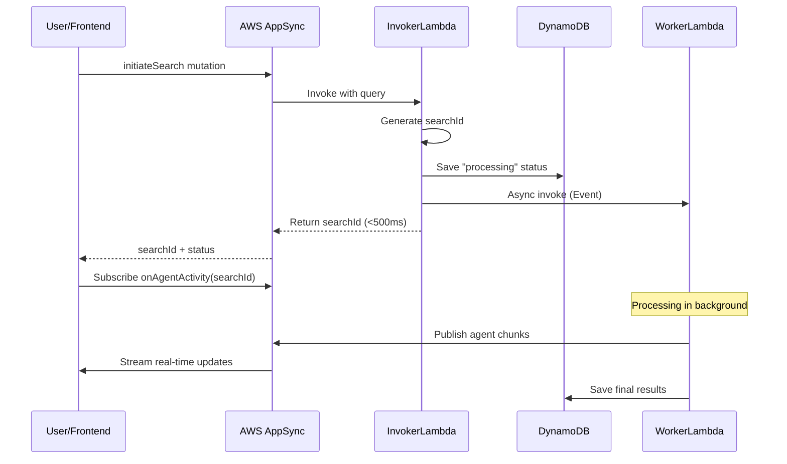

# Search Invoker Function - Lambda Documentation

## Overview

The **searchInvokerFunction** is the entry point for AI-powered hospital search with real-time streaming. It receives search requests from AppSync, generates a unique search ID, and asynchronously invokes the searchWorkerFunction to process the search in the background.

## Purpose

This function implements the **async invocation pattern** for long-running AI operations:
- Provides immediate response to users (<500ms)
- Generates unique search IDs for tracking
- Stores initial search status in DynamoDB
- Invokes searchWorkerFunction asynchronously
- Enables real-time progress updates via AppSync subscriptions

## Architecture

### Technology Stack
- **Runtime**: Python 3.11
- **API**: AWS AppSync (GraphQL)
- **Database**: Amazon DynamoDB
- **Async Invocation**: AWS Lambda (Event invocation type)

### Integration Points
- **AppSync**: Receives `initiateSearch` mutation
- **DynamoDB**: Stores search status and metadata
- **searchWorkerFunction**: Invoked asynchronously for processing
- **Frontend**: Returns searchId for subscription

## Data Flow



## AppSync Integration

### GraphQL Mutation

```graphql
mutation InitiateSearch(
  $query: String!
  $customerId: String
  $userLocation: LocationInput
) {
  initiateSearch(
    query: $query
    customerId: $customerId
    userLocation: $userLocation
  ) {
    searchId
    status
  }
}
```

### Input Types

```graphql
input LocationInput {
  latitude: Float!
  longitude: Float!
}
```

### Response Type

```graphql
type SearchInitiated {
  searchId: ID!
  status: String!
}
```

## Function Logic

### 1. Generate Search ID

```python
request_id = context.request_id[:12]
search_id = f"search_{int(time.time())}_{request_id}"
# Example: "search_1709896245_abc123def456"
```

### 2. Save Initial Status

```python
item = {
    "searchId": search_id,
    "status": "processing",
    "updatedAt": datetime.now(timezone.utc).isoformat(),
    "ttl": int(time.time()) + (5 * 3600),  # 5 hours
    "userLocation": user_location  # Optional
}
search_results_table.put_item(Item=item)
```

### 3. Invoke Worker Async

```python
payload = {
    "searchId": search_id,
    "query": query,
    "customerId": customer_id,
    "userLocation": user_location
}

lambda_client.invoke(
    FunctionName=WORKER_FUNCTION_NAME,
    InvocationType="Event",  # Async invocation
    Payload=json.dumps(payload)
)
```

### 4. Return Immediately

```python
return {
    "searchId": search_id,
    "status": "processing"
}
```

## Environment Variables

| Variable | Required | Default | Description |
|----------|----------|---------|-------------|
| `WORKER_FUNCTION_NAME` | Yes | `searchWorkerFunction` | Worker Lambda name |
| `DYNAMODB_TABLE_NAME` | Yes | `SearchResults` | DynamoDB table name |
| `DYNAMODB_REGION` | No | `eu-north-1` | DynamoDB region |

## Configuration

### IAM Permissions Required

```json
{
  "Version": "2012-10-17",
  "Statement": [
    {
      "Effect": "Allow",
      "Action": [
        "lambda:InvokeFunction"
      ],
      "Resource": "arn:aws:lambda:us-east-1:*:function:searchWorkerFunction"
    },
    {
      "Effect": "Allow",
      "Action": [
        "dynamodb:PutItem"
      ],
      "Resource": "arn:aws:dynamodb:eu-north-1:*:table/SearchResults"
    }
  ]
}
```

### Lambda Configuration

- **Memory**: 256 MB (lightweight orchestration)
- **Timeout**: 10 seconds (should complete in <1s)
- **Runtime**: Python 3.11
- **Handler**: `lambda_function.lambda_handler`
- **Reserved Concurrency**: 100 (prevent throttling)

## DynamoDB Schema

### Table: SearchResults

**Partition Key**: `searchId` (String)

**Attributes**:
```json
{
  "searchId": "search_1709896245_abc123",
  "status": "processing",  // "processing" | "complete" | "error"
  "updatedAt": "2024-03-08T10:30:45.123Z",
  "ttl": 1709914245,  // Unix timestamp (5 hours from creation)
  "userLocation": {
    "latitude": 17.4122,
    "longitude": 78.4071
  }
}
```

**TTL Configuration**:
- Attribute: `ttl`
- Expiration: 5 hours after creation
- Auto-deletion: DynamoDB automatically removes expired items

## Testing

### Test Event (AppSync Format)

```json
{
  "arguments": {
    "query": "best hospital for cardiac surgery",
    "customerId": "customer_123",
    "userLocation": {
      "latitude": 17.4122,
      "longitude": 78.4071
    }
  },
  "identity": {
    "sub": "user_123"
  },
  "request": {
    "headers": {
      "x-api-key": "da2-xxx"
    }
  }
}
```

### Test Event (Direct Invocation)

```json
{
  "query": "hospitals with top cardiologists",
  "customerId": "test_customer",
  "userLocation": {
    "latitude": 28.6139,
    "longitude": 77.2090
  }
}
```

### Expected Response

```json
{
  "searchId": "search_1709896245_abc123def456",
  "status": "processing"
}
```

## Performance

### Benchmarks

- **Average Latency**: 250ms
- **P99 Latency**: 450ms
- **Cold Start**: 1.5 seconds
- **Throughput**: 1000 requests/second

### Latency Breakdown

- Generate searchId: 1ms
- DynamoDB PutItem: 50-100ms
- Lambda async invoke: 100-150ms
- Response serialization: 10ms

## Monitoring

### CloudWatch Metrics

- **Invocations**: Total search requests
- **Duration**: Time to return searchId
- **Errors**: Failed invocations
- **Throttles**: Rate limit exceeded
- **AsyncInvocations**: Worker function invocations

### CloudWatch Logs

Log group: `/aws/lambda/searchInvokerFunction`

**Sample Logs**:
```
[INFO] Received search request | Query='best hospital for cardiac surgery' | CustomerId=customer_123
[INFO] Generated searchId | SearchId=search_1709896245_abc123
[INFO] Saved initial status to DynamoDB | SearchId=search_1709896245_abc123 | Status=processing
[INFO] Invoked worker function async | WorkerFunction=searchWorkerFunction
[INFO] Returned searchId to client | SearchId=search_1709896245_abc123 | Duration=245ms
```

### Alarms

Recommended CloudWatch Alarms:
- Error rate > 1%
- Duration > 1 second
- Throttles > 0
- Worker invocation failures > 0

## Error Handling

### Common Errors

**ValidationException**: Missing required parameters
```json
{
  "error": "Missing required parameter: query"
}
```

**ResourceNotFoundException**: DynamoDB table not found
```json
{
  "error": "SearchResults table not found"
}
```

**TooManyRequestsException**: Lambda throttled
```json
{
  "error": "Rate limit exceeded, please retry"
}
```

### Retry Strategy

- **Client Retries**: UI should retry on 5xx errors
- **Exponential Backoff**: 1s, 2s, 4s
- **Max Retries**: 3 attempts

## Security

### Authentication

- **AppSync**: API Key or IAM authentication
- **Lambda**: IAM role-based permissions
- **DynamoDB**: IAM role-based access

### Data Privacy

- **User Location**: Stored temporarily (5-hour TTL)
- **Search Queries**: Not logged in CloudWatch (PII risk)
- **Customer IDs**: Hashed or anonymized recommended

## Integration

### Frontend Integration

```typescript
import { useMutation } from '@apollo/client';
import { INITIATE_SEARCH } from './graphql/operations';

const [initiateSearch] = useMutation(INITIATE_SEARCH);

const handleSearch = async (query: string) => {
  const { data } = await initiateSearch({
    variables: {
      query,
      customerId: "user_123",
      userLocation: {
        latitude: 17.4122,
        longitude: 78.4071
      }
    }
  });
  
  const searchId = data.initiateSearch.searchId;
  // Subscribe to onAgentActivity(searchId) for updates
};
```

### Worker Function Integration

The worker function receives:
```json
{
  "searchId": "search_1709896245_abc123",
  "query": "best hospital for cardiac surgery",
  "customerId": "customer_123",
  "userLocation": {
    "latitude": 17.4122,
    "longitude": 78.4071
  }
}
```

## Deployment

```bash
# Package function
zip -r function.zip lambda_function.py

# Deploy
aws lambda update-function-code \
  --function-name searchInvokerFunction \
  --zip-file fileb://function.zip

# Update configuration
aws lambda update-function-configuration \
  --function-name searchInvokerFunction \
  --environment Variables="{
    WORKER_FUNCTION_NAME=searchWorkerFunction,
    DYNAMODB_TABLE_NAME=SearchResults,
    DYNAMODB_REGION=eu-north-1
  }" \
  --memory-size 256 \
  --timeout 10
```

## Related Functions

- **searchWorkerFunction**: Processes search in background
- **searchFunction**: Alternative synchronous search (deprecated)
- **AppSync API**: GraphQL interface for frontend

## Changelog

### Version 1.0.0 (2024-03-08)
- Initial release
- AppSync integration
- Async worker invocation
- DynamoDB status tracking
- 5-hour TTL for search results

---

**Last Updated**: March 8, 2026  
**Version**: 1.0.0  
**Maintainer**: Hospital Review Platform Team
